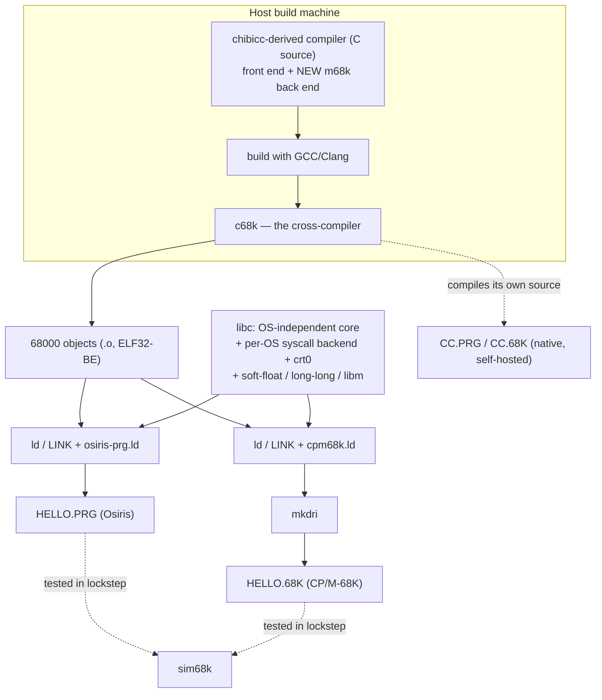

# c68k

**A C99 compiler for the Motorola 68000 that produces native executables for both
Osiris DOS (OS/68K) and CP/M-68K — from one source tree, on the same toolchain that builds
Osiris.**

> **Status:** Draft 0.1 — **P0–P13 essentially complete.** The compiler is a big-endian ILP32 C99
> cross-compiler with a 68000 code generator, a hosted C library, and an integrated ELF emitter; it
> **self-hosts** (stage2 == stage3 byte-identical on Osiris), runs the **lockstep** conformance suite
> green on both OSes, has an **`-O1` optimization tier** (~20 % smaller code) and **`-g` DWARF**
> source-level debugging, and ships an SDK with a User's/Reference manual. Milestones **M1–M5** are
> reached; the one remaining P13 item is a full register allocator. Progress is tracked in
> [docs/implementation-plan.md](docs/implementation-plan.md#progress-dashboard).

---

## What it is

c68k is a **retarget of [chibicc](https://github.com/rui314/chibicc)** (Rui Ueyama's small,
readable C11 compiler) to the **MC68000**, with two operating-system targets:

- **Osiris DOS (OS/68K)** — a clean-room MS-DOS-5.0-style kernel; DOS on `TRAP #1`, handle files,
  `.PRG` (ELF32-BE static-PIE) images.
- **CP/M-68K** (Digital Research, 1983) — BDOS on `TRAP #2`, FCB files, `.68K` (DRI) images.

We keep chibicc's proven **C99/C11 front end** (preprocessor, parser, type system) and add a
**fresh 68000 code generator** and a **small C99 standard library**. The **standard C library is
the platform seam**: an OS-independent core plus a thin per-OS backend (the C-runtime syscall
stubs and `crt0`) selects the operating system at **link time** — the same "one core, one backend
per OS" model the sibling projects `pascal68k`, `tbasic`, and `Frotz68k` use.

### Two shipped compilers, one source

| Artifact | Runs on | Produces | Purpose |
| --- | --- | --- | --- |
| **`c68k` (cross)** | the host (Windows/Linux/macOS) | Osiris `.PRG` and CP/M-68K `.68K` | a **maintained** cross-compiler for building *any* Osiris/CP/M-68K tool |
| **`CC.PRG` / `CC.68K` (native)** | Osiris / CP/M-68K | the same | a **self-hosted** compiler that runs on the target and can recompile itself |

The native compiler is produced *by* the cross-compiler (a standard bootstrap); the cross-compiler
is a first-class, permanent deliverable in its own right.

## Documentation

Start with the [documentation index](docs/README.md). If you are **using** c68k, read the
[User's Manual](docs/users-manual.md) and keep the [Programmer's Reference Manual](docs/reference-manual.md)
handy; if you are **working on** the compiler, read the design docs.

| Document | What it covers |
| --- | --- |
| [docs/users-manual.md](docs/users-manual.md) | **User's Manual** — install, quick start, the driver & every switch, optimization, `-g` debugging, per-OS build/run, the toolchain, testing, limitations, troubleshooting. |
| [docs/reference-manual.md](docs/reference-manual.md) | **Programmer's Reference Manual** — language & ILP32 type model, ABI, object format, driver, optimizations, **every supported standard-library function**, the syscall seam, runtime helpers, toolchain, and the Osiris/CP/M-68K platform table. |
| [docs/sdk.md](docs/sdk.md) | **SDK quickstart** — compile with `c68k`, predefined macros, per-OS link recipes, a worked one-source/two-target example. |
| [docs/architecture.md](docs/architecture.md) | Goals, the chibicc basis, the dual-target strategy, the single self-hosting compiler, the 68000 code model, the platform split, the build/test pipeline, decisions & risks. |
| [docs/libc-and-toolchain.md](docs/libc-and-toolchain.md) | The C library structure, the per-OS syscall seam & `crt0`, the runtime support lib, and the native toolchain (LINK / LIB / `mkdri`). |
| [docs/implementation-plan.md](docs/implementation-plan.md) | The phased build plan (P0–P13) with a live progress dashboard. |

## Architecture at a glance



## Building & testing

c68k **reuses the toolchain that builds Osiris** — no new tools are invented:

- **Assemble / emit objects:** the GNU `m68k-elf` assembler (bring-up) or the compiler's own
  integrated ELF object emitter (self-hosting) → ELF32 big-endian m68k objects.
- **Link:**
  - Osiris: `m68k-elf-ld` (or the native `LINK.PRG`) + `osiris-prg.ld` → `.PRG` (the ELF *is* the
    `.PRG`).
  - CP/M-68K: `m68k-elf-ld` (or a ported native `LINK.68K`) + `cpm68k.ld`, then **`mkdri`** →
    `.68K`.
- **Archive:** `m68k-elf-ar` / the native `LIB` (Osiris) / a ported `LIB.68K` (CP/M-68K).
- **Test** headless under **`sim68k`**, in **lockstep**: every conformance program is compiled for
  *both* OSes and must produce identical, golden-matched output.

The toolchain lives in the sibling **Osiris** repo (`osiris/toolchain/` — `asm68K`, GNU
`m68k-elf` binutils 2.44, `sim68k`); `mkdri` and `cpm68k.ld` come from the **worm68k** toolchain.

## Repository layout

```text
c68k/
  docs/            architecture, libc/toolchain, and the phased plan
  include/         shared headers/equates: syscall seam, target ABI, compiler defs   (P0+)
  src/             the compiler — chibicc front end + the 68000 back end              (P0+)
  libc/            C library: OS-independent core + per-OS backend + crt0             (P4+)
  lib/             runtime support: soft-float, 64-bit long-long, libm                (P3+)
  tools/           linker scripts, LINK/LIB ports, mkdri glue, the lockstep harness   (P0+)
  tests/           C99 conformance programs + golden output                           (P0+)
  samples/         example programs                                                   (P4+)
  makefile  CMakeLists.txt                                                            (P0)
```

The concrete layout and rationale are in
[docs/architecture.md §11](docs/architecture.md#11-repository-layout).

## Provenance & licensing

c68k is **not** a clean-room project: its front end is a **derivative of chibicc**, used under the
MIT License. chibicc's copyright and license notices are preserved in the files derived from it,
and the [LICENSE](LICENSE) records both the project copyright and chibicc's. Everything new — the
68000 back end, the C library, the `crt0`s, the native-toolchain ports, and the docs — is original
work under the same MIT License.

The two target operating systems are consumed **only through their published system-call
interfaces**; c68k does not modify Osiris or CP/M-68K.

## License

Released under the [MIT License](LICENSE) © 2026 Doug Duchene.
Portions © 2019 Rui Ueyama (chibicc), used under the MIT License.
