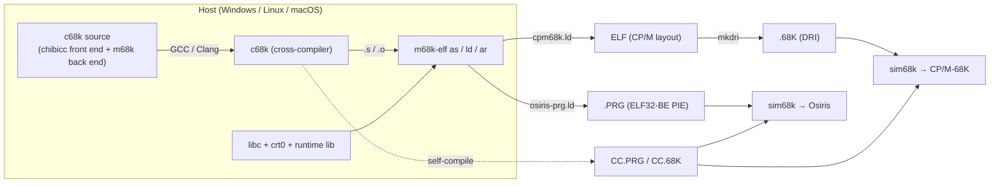
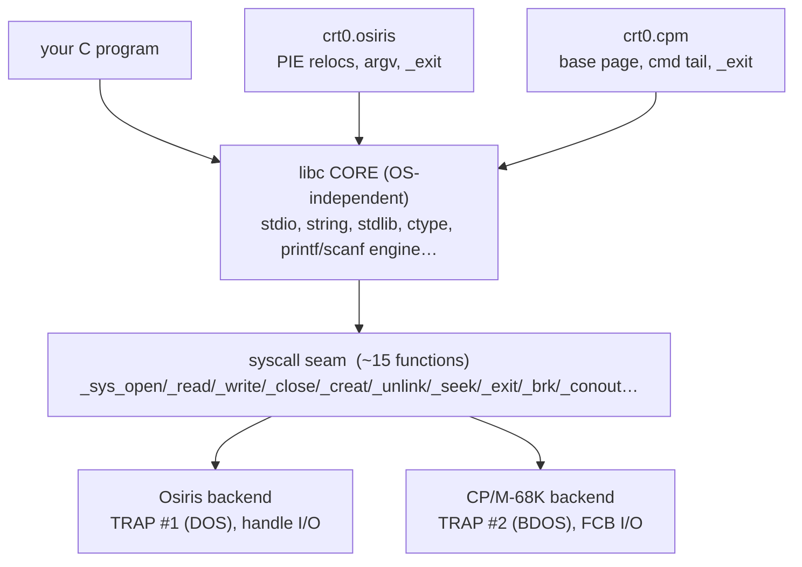
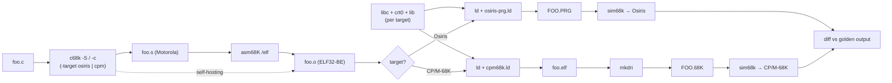
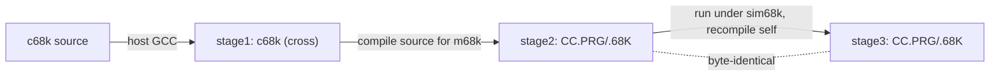

# c68k — Architecture & Design

> **Status:** Draft 0.1 (2026-07) · A native C99 compiler for the MC68000, targeting **Osiris DOS**
> and **CP/M-68K**, derived from **chibicc**.
> Progress is tracked in [implementation-plan.md](implementation-plan.md#progress-dashboard).

## Table of contents

1. [Purpose & scope](#1-purpose--scope)
2. [Goals & non-goals](#2-goals--non-goals)
3. [System context](#3-system-context)
4. [The chibicc basis — what we keep and what we replace](#4-the-chibicc-basis--what-we-keep-and-what-we-replace)
5. [The two targets](#5-the-two-targets)
6. [Dual-target strategy: one back end, split in the C library](#6-dual-target-strategy-one-back-end-split-in-the-c-library)
7. [The 68000 code model](#7-the-68000-code-model)
8. [Object emission: text asm now, integrated ELF later](#8-object-emission-text-asm-now-integrated-elf-later)
9. [The C library platform split](#9-the-c-library-platform-split)
10. [Build & test pipeline](#10-build--test-pipeline)
11. [Repository layout](#11-repository-layout)
12. [The two compilers: cross + native, and the bootstrap](#12-the-two-compilers-cross--native-and-the-bootstrap)
13. [Key decisions](#13-key-decisions)
14. [Risks & mitigations](#14-risks--mitigations)
15. [Glossary](#15-glossary)

---

## 1. Purpose & scope

c68k is a **C99 compiler for the Motorola 68000** that produces **native executables** for two
operating systems from a **single source tree**:

- **Osiris DOS (OS/68K)** — a from-scratch MS-DOS-5.0-class kernel (DOS on `TRAP #1`, BIOS on
  `TRAP #2`), whose programs are `.PRG` files: **ELF32 big-endian static-PIE** images.
- **CP/M-68K** — Digital Research's 1983 68000 CP/M (BDOS on `TRAP #2`), whose programs are
  **`.68K` DRI-format** images.

It is built **with, and tested on, the same toolchain that builds Osiris**: the GNU `m68k-elf`
binutils, `asm68K`, and the `sim68k` emulator, plus `mkdri`/`cpm68k.ld` from the worm68k toolchain.
As a deliberate by-product it yields a **maintained cross-compiler** for building other tools for
both operating systems, and — via a standard bootstrap — a **self-hosting native compiler**.

This document is the architecture. The C library and toolchain details are in
[libc-and-toolchain.md](libc-and-toolchain.md); the phased plan and progress tracking are in
[implementation-plan.md](implementation-plan.md).

## 2. Goals & non-goals

### Goals

- **A conforming C99 compiler** (freestanding + a hosted subset) for the MC68000.
- **Two OS targets** — Osiris and CP/M-68K — from one code base, selectable at link time.
- **Native, self-hosting**: `CC.PRG` / `CC.68K` runs on the target and recompiles its own source.
- **A maintained cross-compiler** for building arbitrary Osiris / CP/M-68K programs on a host.
- **Reuse the Osiris toolchain** unchanged — invent no new assembler, linker, or emulator.
- **A small, readable, hackable** compiler (chibicc's ethos), not a peak-optimizer.
- **Correct big-endian ILP32 code** that interoperates with the Osiris ABI and existing objects.

### Non-goals (for now)

- **No optimizing back end** at first — correct, straightforward code generation precedes speed
  (a peephole/regalloc pass is a *late* phase, [P12](implementation-plan.md#p12--optimization)).
- **No C++, no full C11/C17/C23** — C99 is the bar; selected C11 niceties chibicc already has
  (e.g. `_Bool`, `_Alignof`) come along for free.
- **No MMU / virtual memory / dynamic loading** — the 68000 has none; images are flat and static.
- **No hardware-float assumption** — the base 68000 has no FPU; floating point is software (an
  optional 68881/68882 path is a possible future knob, not a P0 goal).
- **No modification of the target OSes** — Osiris and CP/M-68K are consumed only through their
  published syscall interfaces.

## 3. System context



The compiler is **OS-agnostic**: it emits ordinary C-ABI 68000 code that contains **no `TRAP`
instructions at all**. Every operating-system interaction happens inside the **C library's syscall
backend**, which is the *only* place a `TRAP #1` (Osiris DOS) or `TRAP #2` (CP/M BDOS) is issued.
That is what lets a single back end serve both operating systems.

## 4. The chibicc basis — what we keep and what we replace

c68k is a **fork of [chibicc](https://github.com/rui314/chibicc)** (Rui Ueyama), a ~9,000-line,
single-pass C11 compiler written in clean C89/C99. chibicc is **MIT-licensed**; this is a
**derivative work, not clean-room** — see [§13](#13-key-decisions) and the [LICENSE](../LICENSE).
Its shape is a near-perfect fit for this project: it is small enough to read end-to-end, already
**self-hosts**, has **no external dependencies**, and includes its **own C preprocessor**.

| chibicc module | Role | c68k disposition |
| --- | --- | --- |
| `tokenize.c` | Lexer, `#`-line handling, string/number scanning | **Keep** (minor: 68000 `char`/wchar, `__INT_MAX__`-class macros) |
| `preprocess.c` | Full C preprocessor (macros, conditionals, `#include`) | **Keep** (adjust predefined macros & include search) |
| `parse.c` | Parser + semantic analysis → typed AST | **Keep** (retarget integer-constant/`sizeof`/alignment to ILP32) |
| `type.c` | C type system, usual conversions, type sizes | **Retarget** — the type model becomes big-endian ILP32 ([§7.1](#71-type-model-ilp32-big-endian)) |
| `codegen.c` | **x86-64** code generator (AT&T text, stack-machine) | **Replace** with a **68000** code generator ([§7](#7-the-68000-code-model)) |
| `hashmap.c`, `strings.c`, `unicode.c` | Support utilities | **Keep** |
| `main.c` | Driver / option parsing | **Extend** — target/OS selection, object-emit mode |
| `chibicc.h` | Shared decls | **Keep + extend** |

chibicc's generator is a **stack machine**: it evaluates each expression by pushing/popping through
a single accumulator and the hardware stack. That structure ports *directly* to the 68000 (a rich
two-operand CISC with `Dn`/`An` registers and `LINK`/`UNLK` frames): the initial back end reuses the
same push/pop discipline (accumulator = `D0`), which is the fastest route to *correct* code. A
register allocator that keeps temporaries in `D2–D7`/`A2–A5` is a later optimization
([P12](implementation-plan.md#p12--optimization)), not a prerequisite for self-hosting.

## 5. The two targets

| Property | **Osiris DOS (OS/68K)** | **CP/M-68K** |
| --- | --- | --- |
| Era / origin | New, MS-DOS-5.0-class, clean-room | Digital Research, 1983 |
| OS entry | **DOS = `TRAP #1`**, BIOS = `TRAP #2`, terminate = `4Ch` / `TRAP #3` | **BDOS = `TRAP #2`**, BIOS via BDOS |
| File model | **Handle-based** (open/read/write/close, DOS-style) | **FCB-based** (DRI BDOS functions) |
| Executable | **`.PRG`** — ELF32 **big-endian**, **static-PIE** (`ET_DYN`, `R_68K_RELATIVE` only, no GOT/PLT) | **`.68K`** — DRI contiguous/relocatable format |
| Address model | Flat, no MMU; 68008 board ≤ 1 MB, 68000 board ≤ 16 MB | Flat TPA above a **base page**; no MMU |
| Load base | Relocatable (PIE) — loader applies `R_68K_RELATIVE` | Relocated to the TPA by the loader / `mkdri` fixups |
| Command line / env | DOS-style PSP-equivalent passed by the loader | Base-page command tail + two default FCBs |
| Produced by | `ld` + `osiris-prg.ld` (the ELF *is* the `.PRG`) | `ld` + `cpm68k.ld`, then **`mkdri`** (ELF → `.68K`) |

Both are **big-endian, flat-address, no-MMU, no-FPU** 68000 systems. The differences the compiler
cares about are entirely **(a) the executable container** and **(b) the system-call interface** —
both isolated behind the toolchain and the libc backend, respectively. The *code generator* is
identical for both.

## 6. Dual-target strategy: one back end, split in the C library

The platform split lives **entirely in the C library**, in a thin **syscall seam** plus a per-OS
**`crt0`** — never in the compiler. This mirrors the proven structure of the sibling 68000 language
ports (`pascal68k`'s PAL, `tbasic`, `Frotz68k`): an OS-independent core over a small
platform-abstraction layer.



- **Core** (OS-independent): the bulk of the library — `<stdio.h>`, `<string.h>`, `<stdlib.h>`,
  `<ctype.h>`, the `printf`/`scanf` engine, `<time.h>` formatting, etc. Written once, compiled once.
- **Seam** (~15 primitives): raw byte I/O, file open/creat/close/unlink/seek, process exit, heap
  extension (`_sbrk`), and console glue. Each has an **Osiris** implementation (DOS `TRAP #1`) and a
  **CP/M-68K** implementation (BDOS `TRAP #2`, including FCB packing and the sector/record model).
- **`crt0`** (per OS): sets up the C environment from the OS's start state — on Osiris, walk the
  ELF PIE relocations if the loader hasn't, marshal the command line into `argv[]`, then call
  `main`, then `_exit`; on CP/M-68K, read the base-page command tail into `argv[]`, set the heap
  break below the stack, call `main`, then BDOS-0.

The full seam table (each primitive → its Osiris DOS call and its CP/M BDOS call) is in
[libc-and-toolchain.md §3](libc-and-toolchain.md#3-the-syscall-seam).

## 7. The 68000 code model

### 7.1 Type model (ILP32, big-endian)

chibicc is **LP64** (x86-64: `long`/pointer = 8 bytes). c68k retargets `type.c` to **ILP32
big-endian**:

| C type | Size (bytes) | Notes |
| --- | --- | --- |
| `char` (signed by default) | 1 | |
| `short` | 2 | |
| `int` | **4** | 32-bit `int` — see the decision below |
| `long` | 4 | |
| `long long` | 8 | software-emulated ([lib §runtime](libc-and-toolchain.md#5-the-runtime-support-library)) |
| pointer, `size_t`, `ptrdiff_t` | 4 | flat 32-bit address space |
| `float` | 4 | IEEE-754 single, **soft-float** |
| `double`, `long double` | 8 | IEEE-754 double, **soft-float** (`long double` == `double`) |
| `_Bool` | 1 | |

- **Endianness:** big-endian — matching the 68000, Osiris ELF objects, and CP/M-68K. Multi-byte
  scalars and struct layout are MSB-first; alignment is the **GNU m68k-elf SysV default: 2-byte for
  every type ≥ 16 bits** (`short`/`int`/`long`/`long long`/`float`/`double`/pointer all align to 2;
  `char` to 1). The 68000 only requires **even alignment** for word/long accesses; `-malign-int`
  (4-byte) is a reserved, non-default knob. `long` and `long long` are distinct types (4 vs 8 bytes).
- **`int` is 32-bit (ILP32), not 16-bit.** This is the single most consequential type decision.
  32-bit `int` gives least-surprise C99 semantics, matches the **GNU `m68k-elf` ABI** and the Osiris
  32-bit register ABI, and interoperates cleanly with existing objects and headers. The cost is
  larger/slower code than a 16-bit `int` would give on a 68000. A future **`-mshort`** knob (16-bit
  `int`, à la GCC) is reserved for legacy CP/M-68K compatibility, but the default and the tested
  configuration are 32-bit `int`.

### 7.2 Calling convention & ABI

c68k uses a **standard m68k C ABI** that is register-compatible with the Osiris ABI
(`osiris/docs/abi-68k.md §3.4`):

| Aspect | Convention |
| --- | --- |
| Argument passing | **On the stack**, pushed **right-to-left**; **caller** cleans up (cdecl) |
| Integer / pointer return | **`D0`** (`D0:D1` pair for 64-bit `long long`) |
| Struct/union return | Caller passes a **hidden pointer**; small structs may be returned in `D0:D1` |
| Scratch (caller-saved) | **`D0`, `D1`, `A0`, `A1`** |
| Preserved (callee-saved) | **`D2–D7`, `A2–A6`** |
| Frame pointer | **`A6`** (`LINK A6,#-frame` / `UNLK A6`) |
| Stack pointer | **`A7`** (`SP`); full-descending, even-aligned |
| Floating return | `D0`(:`D1`) as a soft-float bit pattern (no FPU) |

Keeping caller/callee-saved sets identical to the Osiris ABI means c68k output and hand-written
Osiris assembly (and the binutils world) **intercall without thunks**.

### 7.3 Code generation & code model

- **Position independence.** Osiris `.PRG` images are **static-PIE**: the loader applies only
  `R_68K_RELATIVE` fixups (no GOT/PLT). As implemented, c68k emits **absolute 32-bit** references for
  globals and function addresses (`LEA sym,An` / `JSR sym`) and records them as `R_68K_32`
  relocations, which the Osiris linker rewrites to `R_68K_RELATIVE` for the `.PRG`. Absolute
  addressing is chosen **deliberately over PC-relative**: `(d16,PC)` reaches only ±32 KB, which a
  global far from the referencing code would overflow. **Local** control flow (branches within a
  function) is PC-relative `Bcc.W`. CP/M-68K `.68K` images are not PIE (they carry DRI relocation
  fixups applied at load), so the same absolute `R_68K_32` references are converted to DRI fixups by
  `mkdri`. (A PC-relative/short-form code model remains a possible future optimization.)
- **Big-endian, even-aligned.** All word/long memory access is even-aligned (the 68000 traps on an
  odd word access); the AST-to-frame layout guarantees even offsets for word+ scalars.
- **Stack-machine first, registers later.** The initial generator mirrors chibicc's push/pop model
  (accumulator = `D0`, second operand popped into `D1`, spill via `-(SP)`), which is directly
  correct on the 68000. On top of it an **`-O1` optimization tier**
  ([P12](implementation-plan.md#p12--optimization)/[P13](implementation-plan.md#p13--tooling--debug-polish))
  adds immediate-operand selection, power-of-two strength reduction, a **peephole pass**, and an
  addressing-mode fold that clean the push/pop residue (~20 % smaller code). A full
  **register allocator** that promotes hot values into `D2–D7`/`A2–A5` remains reserved future work.
- **No `TRAP`s in generated code.** All OS interaction is via ordinary `BSR`/`JSR` into libc; the
  compiler is OS-neutral.

## 8. Object emission: text asm now, integrated ELF later

The compiler needs to turn the AST into linkable **ELF32 big-endian m68k objects**. There are two
emit paths, introduced in that order:

1. **Assembly text → `asm68K`** (bring-up, [P2](implementation-plan.md#p2--68000-code-generation)).
   Like upstream chibicc, emit assembly text and shell out to an assembler to make the `.o` — but the
   assembler is **`asm68K`** (Motorola-syntax, MASM-style), invoked `asm68K /elf /c /Fo<obj>`, which
   writes **ELF32-BE** objects (and DWARF 2 under `/Zi`). c68k emits **Motorola syntax**, *not* GNU
   MIT syntax, so it does **not** use `m68k-elf-as`. Fastest to get correct code and to debug (the
   text is human-readable). This is the path the **cross-compiler** uses throughout bring-up.
2. **Integrated ELF object emitter** (self-hosting, [P8](implementation-plan.md#p8--integrated-object-emitter)).
   A built-in code emitter that writes ELF32-BE relocatable objects **directly** — no external
   assembler. This is required for a **self-contained native compiler**, because *Osiris has a
   native `LINK` and `LIB` but no native assembler*. The native `CC.PRG`/`CC.68K` therefore emits
   `.o` files itself and hands them straight to the native `LINK`.

Both paths share the same instruction-selection layer; only the *encoder* differs (mnemonic text vs.
binary opcodes + relocation records). The integrated emitter is validated by **byte-comparing** its
objects against the `asm68K` output for the same input during P8.

## 9. The C library platform split

Summarized here; specified in [libc-and-toolchain.md](libc-and-toolchain.md).

- **`libc/core/`** — OS-independent C99 library (hosted subset): `stdio`, `string`, `stdlib`,
  `ctype`, `errno`, `assert`, `stdarg` glue, the `printf`/`scanf` formatting engine, `time`
  formatting. Compiled once, linked into both targets.
- **`libc/osiris/`** — the syscall seam over **DOS `TRAP #1`** (handle I/O, DOS file ops) plus
  `crt0.osiris` (PIE relocation walk if needed, `argv` from the loader block, `_exit` via `4Ch`).
- **`libc/cpm/`** — the syscall seam over **BDOS `TRAP #2`** (FCB open/close/read/write, record/DMA
  model, console functions) plus `crt0.cpm` (base-page command tail → `argv`, heap break, BDOS-0
  exit).
- **`lib/` (runtime support)** — the compiler's helper library: **soft-float** (IEEE single/double
  add/sub/mul/div/compare/convert), **64-bit `long long`** arithmetic, and **32-bit multiply/divide
  /modulo/shift** helpers the 68000 lacks in one instruction. Emitted-code calls resolve here.
- **`lib/libm`** — a math library sourced from a permissive donor (e.g. **openlibm** / **fdlibm** /
  picolibc's libm) adapted to soft-float ILP32-BE; OS-independent.

## 10. Build & test pipeline



- **Toolchain (reused from Osiris/worm68k):** the assembler is **`asm68K`** (Motorola syntax → ELF +
  DWARF); `m68k-elf` binutils 2.44 (`ld`/`ar`) provide the linker/archiver at
  `osiris/toolchain/binutils`; `asm68K` at `osiris/toolchain/asm68k`; `sim68k` at
  `osiris/toolchain/sim68k` (it runs **both** Osiris and CP/M-68K); `mkdri` + `cpm68k.ld` from
  `worm68k`.
- **Lockstep testing.** Every conformance test is compiled for **both** OSes, run headless under
  `sim68k`, and its captured stdout is `diff`ed against a single golden file. A test passes only if
  **both** targets match — this catches OS-seam bugs and codegen bugs at once. The harness lives in
  `tools/` and is scripted with the repo `makefile`.
- **Three-stage self-host check** ([P10](implementation-plan.md#p10--self-hosting-bootstrap)):
  stage1 = cross builds `c68k`; stage2 = `c68k` builds the native compiler; stage3 = the native
  compiler rebuilds itself under `sim68k` and the stage2/stage3 objects must be **byte-identical**.

## 11. Repository layout

```text
c68k/
  README.md                 project overview
  LICENSE                   MIT (+ chibicc attribution)
  docs/
    README.md               documentation index
    architecture.md         this document
    libc-and-toolchain.md   C library + native toolchain design
    implementation-plan.md  phased plan + progress dashboard
  src/                      the compiler
    tokenize.c preprocess.c parse.c type.c   ← chibicc front end (kept)
    codegen68k.c            ← NEW 68000 code generator (replaces codegen.c)
    emit_elf.c              ← NEW integrated ELF32-BE object emitter (P8)
    main.c chibicc.h        ← extended driver + shared decls
  include/                  target headers/equates shared by compiler & libc
    osiris-sys.inc  cpm-sys.inc   syscall equates for each OS
  libc/
    core/                   OS-independent C99 library
    osiris/                 Osiris syscall seam + crt0.osiris
    cpm/                    CP/M-68K syscall seam + crt0.cpm
    include/                C standard headers (<stdio.h>, <string.h>, …)
  lib/
    runtime/                soft-float, long long, mul/div/shift helpers
    libm/                   math library (soft-float)
  tools/
    osiris-prg.ld cpm68k.ld linker scripts (mirrored/derived from Osiris/worm68k)
    link/ lib/              CP/M-68K ports of the native LINK / LIB tools
    mkdri-glue/             ELF→.68K conversion wiring
    run-sim.ps1 lockstep.*  the sim68k test harness
  tests/                    C99 conformance programs + golden output
  samples/                  example programs
  makefile  CMakeLists.txt  host build of the cross-compiler + test driver
```

## 12. The two compilers: cross + native, and the bootstrap

c68k ships **two** compiler binaries from one source, and both are maintained:

- **`c68k` (cross-compiler)** — built by the host's GCC/Clang, runs on the developer's machine,
  emits `.PRG`/`.68K`. It is the **primary tool for building any Osiris or CP/M-68K program** and is
  a permanent deliverable (hardened + CI'd in [P11](implementation-plan.md#p11--cross-compiler-hardening)),
  not merely a bootstrap stepping-stone.
- **`CC.PRG` / `CC.68K` (native)** — the same compiler compiled *by* the cross-compiler *for* the
  target, running under Osiris / CP/M-68K and able to recompile its own source
  ([P10](implementation-plan.md#p10--self-hosting-bootstrap)). Self-hosting requires the integrated
  ELF emitter ([§8](#8-object-emission-text-asm-now-integrated-elf-later)) because the targets have
  no native assembler.



## 13. Key decisions

| # | Decision | Rationale |
| --- | --- | --- |
| D1 | **Fork chibicc** (not clean-room, not GCC) | ~9k readable LOC, already self-hosts, own preprocessor, no deps, MIT. Native GCC is impossible on a no-MMU 68000 (can't page GCC's footprint; the 68000 can't restart faulted instructions). |
| D2 | **Preserve chibicc's MIT attribution** | It is a derivative work; original copyright/notices are retained in derived files and in [LICENSE](../LICENSE). |
| D3 | **ILP32 big-endian, 32-bit `int`** | Least-surprise C99, matches GNU `m68k-elf` + Osiris 32-bit ABI + existing objects. `-mshort` reserved for legacy CP/M compatibility. |
| D4 | **Standard m68k C ABI, register-aligned with Osiris** | Thunk-free interop with Osiris asm and binutils; `D2–D7/A2–A6` callee-saved matches `abi-68k.md`. |
| D5 | **Platform split in the C library only** | One OS-neutral back end; the ~15-call seam + `crt0` absorb all Osiris↔CP/M differences (the pascal68k PAL model). |
| D6 | **Two emit paths: `.s`→`as` then integrated ELF** | Text asm is fastest to correctness for the cross tool; the integrated emitter is mandatory for a native self-host (no native assembler on target). |
| D7 | **Reuse the Osiris/worm68k toolchain unchanged** | `as`/`ld`/`ar`/`asm68K`/`sim68k`/`mkdri` already exist and are trusted; inventing tools is wasted risk. |
| D8 | **CP/M-68K native linking via ported LINK/LIB + `mkdri`** | Gives CP/M-68K a native build chain matching Osiris's, converging on `mkdri` for the final `.68K`. |
| D9 | **Soft-float + `long long` in a runtime lib** | Base 68000 has no FPU and no 32×32/64-bit unit; helpers keep codegen simple and OS-independent. |
| D10 | **Lockstep dual-OS testing under sim68k** | One golden file, both OSes must match — catches seam and codegen faults together. |
| D11 | **Host the cross-compiler on Windows (MSVC) + macOS (Clang); Linux is CI-only** | Those are the maintainers' tools. A thin `src/compat.{h,c}` shim isolates the POSIX/Win32 differences (spawn, `open_memstream`, `strndup`, `dirname`/`basename`, `mkstemp`, `ctime_r`). chibicc's interim x86-64 back end still assembles/links/self-hosts only on Linux, so an x86-64 Linux CI job is retained as a full-suite + stage2==stage3 safety net until the 68000 back end (P2+) moves execution testing under `sim68k` on every host. |

## 14. Risks & mitigations

| Risk | Impact | Mitigation |
| --- | --- | --- |
| **`.PRG` static-PIE codegen** (PC-relative everywhere; stray absolutes) | Osiris images crash or mis-relocate | Emit PC-relative by construction; route absolutes through `R_68K_RELATIVE` data words; add a **relocation self-check** test; **ET_EXEC (fixed-load, non-PIE) fallback** if PIE proves too costly early. |
| **Integrated ELF emitter correctness** | Native self-host produces bad objects | Build it late (P8); **byte-diff** its objects against `m68k-elf-as` for the whole test corpus before trusting it. |
| **Soft-float conformance** (rounding, NaN/Inf, edge cases) | Silent numeric errors | Source from a proven donor (openlibm/fdlibm/Berkeley SoftFloat-style); test against host `double` golden values. |
| **68000 odd-address & alignment traps** | Random crashes on word/long access | Alignment enforced in frame/struct layout; a targeted misalignment test; `-Waddress`-style checks. |
| **chibicc single-pass limits** (large functions, deep expression temporaries on a stack machine) | Big real programs stress the model | Register/temporary allocator + spill in P12; keep the stack-machine path as the always-correct fallback. |
| **CP/M-68K FCB/record I/O impedance** vs. byte-stream `stdio` | `fread`/`fwrite` semantics off on CP/M | Buffer at the seam; a CP/M-specific record→byte shim; dedicated CP/M I/O tests in the lockstep suite. |
| **Two maintained compilers drift** (cross vs native) | Divergent behavior/bugs | Single source; the P10 three-stage byte-identical check is a permanent CI gate. |

## 15. Glossary

| Term | Meaning |
| --- | --- |
| **chibicc** | Rui Ueyama's small MIT-licensed C11 compiler; c68k's front-end basis. |
| **Osiris / OS/68K** | The clean-room MS-DOS-5-class 68000 kernel; DOS = `TRAP #1`. |
| **CP/M-68K** | Digital Research's 1983 68000 CP/M; BDOS = `TRAP #2`. |
| **`.PRG`** | Osiris executable: ELF32 big-endian **static-PIE** (`ET_DYN`, `R_68K_RELATIVE` only). |
| **`.68K`** | CP/M-68K DRI executable format, produced by `mkdri`. |
| **ILP32** | `int`, `long`, and pointer are all 32-bit. |
| **PIE** | Position-Independent Executable — runs at any load address via relocations. |
| **crt0** | C runtime startup: sets up `argv`/heap/relocs, calls `main`, then exits. |
| **seam / syscall stub** | The ~15-function boundary where libc issues the OS `TRAP`. |
| **soft-float** | IEEE-754 arithmetic done in software (no FPU on the base 68000). |
| **`mkdri`** | Tool that converts a linked ELF into a CP/M-68K `.68K` image. |
| **sim68k** | The 68000 emulator used for headless testing (runs both OSes). |
| **lockstep test** | A program compiled for both OSes whose outputs must match one golden file. |

---

### Changelog

| Date | Version | Change |
| --- | --- | --- |
| 2026-07 | Draft 0.1 | Initial architecture: chibicc basis, dual-target strategy, 68000 code model, libc split, build/test pipeline, decisions & risks. |
