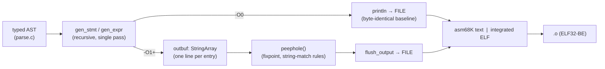
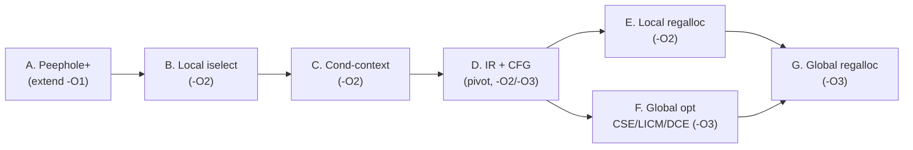

# c68k — Code Generation: Architecture, Design & Optimization Roadmap

> **Status:** Draft 0.1 (2026-07) · The MC68000 back end ([`src/codegen68k.c`](../src/codegen68k.c)):
> how it turns the typed AST into 68000 code, the optimizations that run today, an analysis of the
> code it currently emits, and a phased roadmap from the present *correct* generator to a full
> optimizing compiler.
> This is a companion to [architecture.md §7](architecture.md#7-the-68000-code-model) (the code
> model) and [§8](architecture.md#8-object-emission-text-asm-now-integrated-elf-later) (object
> emission); it does not repeat the ABI/type-model tables there. Progress is tracked only in
> [implementation-plan.md](implementation-plan.md).

## Table of contents

1. [Purpose & scope](#1-purpose--scope)
2. [Design philosophy](#2-design-philosophy)
3. [Pipeline overview](#3-pipeline-overview)
4. [The machine model](#4-the-machine-model)
5. [Expression generation](#5-expression-generation)
6. [Statement generation](#6-statement-generation)
7. [Function frames](#7-function-frames)
8. [Object emission & symbol references](#8-object-emission--symbol-references)
9. [Current optimizations (`-O1`)](#9-current-optimizations--o1)
10. [Analysis of the generated code](#10-analysis-of-the-generated-code)
11. [Optimization roadmap](#11-optimization-roadmap)
12. [Opportunity catalog](#12-opportunity-catalog)
13. [Design invariants for any optimizer work](#13-design-invariants-for-any-optimizer-work)

---

## 1. Purpose & scope

The back end is a single file, [`src/codegen68k.c`](../src/codegen68k.c) (~1740 lines), that
replaces chibicc's x86-64 `codegen.c`. Its job: walk the typed AST produced by the (retargeted but
otherwise upstream) chibicc front end and emit **Motorola-syntax 68000 assembly** for the two object
back ends (`asm68K` text and the integrated ELF emitter, [§8](#8-object-emission--symbol-references)).

This document covers **instruction selection and the optimizer**. It assumes the ABI, ILP32 type
model, and PIE code model from [architecture.md §7](architecture.md#7-the-68000-code-model).

## 2. Design philosophy

- **Correctness before speed.** The base generator is a faithful port of chibicc's **stack machine**:
  every expression evaluates into an accumulator, with sub-results spilled to the hardware stack via
  `-(SP)`/`(SP)+`. This maps directly onto the 68000 and is the shortest path to *correct* code. It
  is intentionally naive.
- **A single pass, no IR.** Codegen recurses over the AST and emits text as it goes
  ([`gen_expr`](../src/codegen68k.c#L800), [`gen_stmt`](../src/codegen68k.c#L1115)). There is **no
  intermediate representation, no basic-block/CFG structure, and no data-flow analysis.** This is the
  central architectural fact that shapes both what the optimizer can do today and what the roadmap
  must add.
- **The `-O0` byte-identity invariant.** Every optimization is gated behind `opt_level >= 1`. At
  `-O0` the output is exactly the naive stack-machine code, which protects the self-host
  stage2==stage3 byte-identity and the golden/lockstep baselines. This invariant is load-bearing and
  must survive all future work ([§13](#13-design-invariants-for-any-optimizer-work)).
- **Two encoders, one selection layer.** The same emitted mnemonic text feeds both `asm68K` (external
  assembler) and the integrated ELF emitter ([`emit_elf.c`](../src/emit_elf.c)). Any new instruction
  form must be accepted by **both**.

## 3. Pipeline overview



The only structural difference between `-O0` and `-O1+` is buffering:
[`println`](../src/codegen68k.c#L67) writes straight to the file at `-O0`, but at `-O1+` pushes each
line into `outbuf` so [`peephole`](../src/codegen68k.c#L1411) can run a whole-module pass before
[`flush_output`](../src/codegen68k.c#L1465) writes it. The instruction *selection* is otherwise the
same at every level except for the specialized paths in
[`gen_const_binop`](../src/codegen68k.c#L714) ([§9](#9-current-optimizations--o1)).

## 4. The machine model

The generator uses a fixed, hard-wired register discipline — **no register allocation**:

| Register | Role in the back end |
| --- | --- |
| `D0` | **Accumulator.** Every `gen_expr` leaves its result here (`D0:D1` for 64-bit / soft-float double). |
| `D1` | Second operand of a binary op (popped off the stack), and a scratch for extends/shifts. |
| `D2`, `D3` | Second 64-bit operand (`gen_int64_binop` pops into `D2:D3`); otherwise unused. |
| `A0`, `A1` | Address scratch: `A0` = value/EA being loaded, `A1` = destination address in `store()`. |
| `A6` | Frame pointer (`LINK`/`UNLK`); locals at negative, args at positive offsets. |
| `A7`/`SP` | Hardware stack — doubles as the **operand-eval stack** (`push`/`pop`). |
| `D4–D7`, `A2–A5` | **Never touched.** Reserved for the future register allocator. |

Because only the caller-saved set `D0/D1/A0/A1` (plus `D2/D3` for 64-bit) is ever used, generated
functions need **no callee-saved `MOVEM`** — the prologue is just `LINK a6,#-frame` and the epilogue
`UNLK a6 / RTS`. `depth` ([L25](../src/codegen68k.c#L25)) tracks the eval-stack height and is asserted
`== 0` at the end of every function body — a cheap invariant that catches push/pop imbalance.

## 5. Expression generation

[`gen_expr`](../src/codegen68k.c#L800) is a switch over `Node->kind`. The load-bearing helpers:

- **[`gen_addr`](../src/codegen68k.c#L200)** — computes an lvalue's address into `D0`. Locals →
  `lea disp(a6),a0 / move.l a0,d0`; globals/functions → `lea sym,a0 / move.l a0,d0` (absolute, so a
  far global never overflows PC-relative reach — see [architecture §7.3](architecture.md#73-code-generation--code-model));
  `ND_MEMBER` adds the field offset; `ND_DEREF` just evaluates the pointer.
- **[`load`](../src/codegen68k.c#L255) / [`store`](../src/codegen68k.c#L305)** — move a typed value
  between `D0`(`:D1`) and `[A0]`/`[A1]`, with sign/zero extension for sub-int scalars and a byte-wise
  block copy for `struct`/`union`.
- **Binary operators** dispatch three ways at the bottom of `gen_expr`:
  - **Soft-float** ([`gen_flonum_binop`](../src/codegen68k.c#L539)) — push both operands, `JSR` into
    the IEEE-754 runtime (`_fpadd`/`_fpaddd`/…); comparisons decode the CCR the runtime sets,
    special-casing NaN-unordered `<`/`<=` (delta D9).
  - **64-bit `long long`** ([`gen_int64_binop`](../src/codegen68k.c#L591)) — add/sub/logical inline
    with `addx`/`subx`; mul/div/mod/shift/compare via `rt68k` helpers (`__muldi3`, `__divdi3`, …).
  - **32-bit integer/pointer** (the generic tail of `gen_expr`) — the classic stack-machine
    sequence: `gen_expr(rhs) / push / gen_expr(lhs) / pop d1`, then a single two-operand instruction
    (`add.l d1,d0`, `cmp.l d1,d0` + `Scc`, `asl.l d1,d0`, or a `JSR __mulsi3/__divsi3/…`).
- **Casts** ([`cast`](../src/codegen68k.c#L398)) — integer width changes inline (`ext`, `andi`,
  sign-fill), and every integer↔float / float↔double conversion is a soft-float runtime call.
- **Bitfields** — load-shift-mask on read; a full load-modify-store of the storage unit on assign
  ([`gen_expr` ND_ASSIGN](../src/codegen68k.c#L855)).

## 6. Statement generation

[`gen_stmt`](../src/codegen68k.c#L1115) emits structured control flow with a per-construct `count()`
label id:

- **`if` / `?:`** — evaluate the condition, `cmp_zero`, `beq` to the else arm.
- **`for` / `do` / `while`** — begin/continue/break labels; a VLA-declaring loop body also threads an
  `A6`-relative **SP-reclaim marker** so `continue`/`break` drop allocas made in the body.
- **`switch`** — a linear chain of `cmp.l #k,d0 / beq label` (GNU case-ranges via a `sub`/`cmp`/`bls`
  window), then the default/break branch.
- **`return`** — evaluates the value, copies aggregates into the caller's hidden buffer, and `bra`s to
  the single per-function epilogue label `L_return_<fn>`.
- **VLA / `alloca`** — `alloca` grows `SP` and returns it; block/loop markers reclaim it.
- **`setjmp` spill** — a subtree containing a `returns_twice` call spills pending eval-stack
  temporaries to frame slots and reloads them after the call, so `longjmp` re-entry (which restores
  `SP`) doesn't lose them ([`SETJMP_SPILL_SLOTS`](../src/codegen68k.c#L44)).

## 7. Function frames

[`assign_lvar_offsets`](../src/codegen68k.c#L1245) lays out each frame: parameters at positive
`A6` offsets from `+8` (past saved `A6` + return address), narrow scalars right-justified in their
4-byte slot (big-endian), locals packed downward at negative offsets with per-type alignment. A
hidden struct-return pointer, when present, sits at `8(a6)` ahead of the declared params.
[`emit_text`](../src/codegen68k.c#L1336) frames each live function with `LINK a6,#-stack_size` /
`UNLK a6` / `RTS`, seeds `__va_area__` for variadics, and appends `moveq #0,d0` for a falling-off-end
`main`. Dead functions (`!fn->is_live`) are skipped entirely — whole-function dead-code elimination.

## 8. Object emission & symbol references

[`codegen`](../src/codegen68k.c#L1473) emits `.model flat`, then data, then text, then `END`.
**Imports are self-declaring:** [`symref`](../src/codegen68k.c#L128) appends `asm68K`'s inline-external
marker `##` to any reference whose target is not defined in this module, so no module-wide `EXTERN`
list is emitted — a symbol that is neither defined nor referenced produces no undefined entry and thus
forces no needless linkage (the old blanket `EXTERN` bloated objects ~20×; see
[architecture §8](architecture.md#8-object-emission-text-asm-now-integrated-elf-later)).
All gated behind `opt_level >= 1`. Four levers plus two structural ones:

1. **Immediate-operand folding** ([`gen_const_binop`](../src/codegen68k.c#L714)). When the **right**
   operand is a compile-time integer constant (seen through width-preserving casts by
   [`const_int32`](../src/codegen68k.c#L696)), the op folds to an immediate with **no stack traffic**:
   `add`→`addq/subq/add.l` (tightest via [`add_imm`](../src/codegen68k.c#L680)); `and/or/xor`→
   `andi/ori/eori`; relational→`cmp.l #k,d0` + `Scc`; shifts→`asl/lsr/asr #n`.
2. **Power-of-two strength reduction** (same function). `x*const` → `moveq #0` / `neg` / `asl` for
   `0`/`-1`/`2ⁿ`; **unsigned** `x/2ⁿ`→`lsr`, `x%2ⁿ`→`andi #(2ⁿ-1)`. Non-pow2 and *signed* div/mod
   fall through to the runtime helper.
3. **Peephole pass** ([`peephole`](../src/codegen68k.c#L1411), fixpoint, exact-string rules over the
   buffered stream):
   - **R1** — drop `movea.l d0,a0` right after `move.l a0,d0` (address↔data round-trip; `A0==D0`).
   - **R2** — drop a `move.l a0,d0` whose `D0` is overwritten before use (`kills_d0`).
   - **R3** — fold `lea <ea>,a0 / move.l (a0),d0` into `move.l <ea>,d0` (addressing-mode selection),
     guarded so an 8-byte load's second word doesn't lose `A0`.
4. **Tightest immediate encodings** — `moveq` for byte-range constants ([`load_imm`](../src/codegen68k.c#L165)),
   `addq/subq` for ±1..8.
5. **Whole-function dead-code elimination** — `!fn->is_live` functions are not emitted ([§7](#7-function-frames)).
6. **Self-declaring imports** — no dead `EXTERN`s ([§8](#8-object-emission--symbol-references)).

Measured effect: **~18–21 % fewer instructions** (`CORETEST.PRG` 95,824→78,736 at `-O1`; the sample
in [§10](#10-analysis-of-the-generated-code) 533→422 lines). Correctness is preserved — full lockstep
green on both OSes at `-O1`.

## 10. Analysis of the generated code

The following are taken verbatim from `-O1` output of a representative sample
(`add3/sum_loop/idx/cond/reuse/muldiv/cmp_chain/store_const`). They characterize what the *naive
stack machine leaves on the table* even after the current peephole.

### 10.1 Everything round-trips through memory (no register allocation)

`int reuse(int a,int b){ int t=a*b; return t+t; }` →

```asm
  ...                       ; t = a*b computed, stored:
  move.l d0,(a1)            ; store t to -4(a6)
  move.l -4(a6),d0          ; reload t
  move.l d0,-(sp)           ; push t
  move.l -4(a6),d0          ; reload t AGAIN
  move.l (sp)+,d1           ; pop -> d1
  add.l d1,d0              ; t + t
```

`t` is spilled and reloaded **twice** and shuttled through the stack. With `t` in a register this is
`add.l d0,d0`. This pattern — temporaries and reused values living in memory — dominates the output
and is the single biggest cost. **The fix is a register allocator** ([Tier E/G](#11-optimization-roadmap)).

### 10.2 Booleans are materialized then re-tested in condition context

`if (a < b && b < 100)` →

```asm
  cmp.l d1,d0
  slt d0                    ; materialize 0/1 boolean
  andi.l #1,d0
  tst.l d0                  ; ...then test it
  beq L_false_2
```

Every relational produces a 0/1 in `D0` (`Scc` + `andi`), which is then `tst`+`Bcc`-ed — even though
the value only feeds a branch. In an `if`/`for`/`while`/`?:`/`&&`/`||` this should be a bare
`cmp.l d1,d0 / bge L_false_2`, saving **3 instructions per comparison**. The `&&`/`||` chains further
emit dead `bra`s after `bra`/`rts` and adjacent empty labels (`L_else_1:`/`L_end_1:`). See
[Tier C](#11-optimization-roadmap).

### 10.3 The 68000 is a two-operand CISC, but memory operands go unused

`a < b` (both locals) →

```asm
  move.l 12(a6),d0
  move.l d0,-(sp)
  move.l 8(a6),d0
  move.l (sp)+,d1
  cmp.l d1,d0
```

The 68000 accepts a **memory source**: this is `move.l 8(a6),d0 / cmp.l 12(a6),d0` — no push/pop, no
`D1`. Same for `add.l/sub.l/and.l/or.l/eor.l ea,d0`. This removes most push/pop pairs for simple
operands even before full register allocation. See [Tier B](#11-optimization-roadmap).

### 10.4 Constant on the left misses the fast path

`x > 10` is canonicalized by the front end to `10 < x` (constant on the **left**), so
[`gen_const_binop`](../src/codegen68k.c#L714) — which only checks the right operand — misses it and
emits the full push/pop compare. Commutative ops (`+ * & | ^`) and relational ops (by reversing the
condition) should fold a constant on **either** side. See [Tier B](#11-optimization-roadmap).

### 10.5 Address arithmetic ignores indexed addressing and constant folding

`arr[i]` →

```asm
  move.l -12(a6),d0         ; i
  asl.l #2,d0               ; i*4
  move.l d0,-(sp)
  lea _arr,a0
  move.l a0,d0
  move.l (sp)+,d1
  add.l d1,d0              ; base + index
  movea.l d0,a0
  move.l (a0),d0
```

The 68000's `(d8,An,Xn)` indexed mode collapses the base+index add into the load:
`lea _arr,a0 / move.l (i_scaled),d1 / move.l (a0,d1.l),d0`. And `arr[0]` (constant index) still emits
`moveq #0 / asl.l #2 / add` instead of folding to the static address `_arr`. `g = 42` likewise pushes
the destination address through the stack instead of `move.l #42,_g`. See [Tier B](#11-optimization-roadmap).

### 10.6 Redundant epilogue branch and dead zero-init

Every `return` emits `bra L_return_<fn>` immediately followed by `L_return_<fn>:` — a branch to the
next line. And `int t = a*b;` emits a **`MEMZERO` of `t`** (a `dbra` byte loop) *before* the full
assignment that overwrites it — a dead store, and for a 4-byte scalar the loop should be a single
`clr.l` anyway. See [Tier A](#11-optimization-roadmap).

### 10.7 Missed local strength reductions

`a*7` and signed `a/4` both call the runtime (`__mulsi3`, `__divsi3`). `a*7` = `(a<<3)-a` (two shifts/
add); signed `a/2ⁿ` has a standard 3-instruction sign-corrected shift. Small non-pow2 multipliers and
signed pow2 div/mod are reducible. See [Tier B](#11-optimization-roadmap).

### 10.8 Front-end data bloat

Each function emits `__func__`/`__FUNCTION__` static name strings **even when unused, and duplicated**
(e.g. `_L__17` and `_L__16` are both `"store_const"`). They land in one shared `.data`, so the linker
cannot dead-strip them. This is a front-end (`parse.c`) emission, addressable by not materializing
unreferenced `__func__` objects or by giving each its own `SHT` section. See [Tier A](#11-optimization-roadmap).

## 11. Optimization roadmap

The path to a full optimizer is a sequence of tiers. **Tiers A–C** are achievable on the current
single-pass, no-IR structure (peepholes + smarter local selection + a condition-context path).
**Tier D is the pivot**: introducing an IR + CFG, without which the *global* optimizations (E–G)
cannot be done well. Suggested `-O` mapping: keep `-O1` = today; land B/C at `-O2`; land the IR and
global passes at `-O3`.

### Tier A — Peephole & local rewrites *(cheap, low-risk, extend `-O1`)*
Pure per-node-local rewrites on the existing buffered stream:
- **Branch-to-next removal**: drop `bra L` when `L:` is the next line (kills every redundant
  `bra L_return_<fn>`).
- **Dead code after unconditional transfer**: delete instructions between a `bra`/`rts` and the next
  label; coalesce adjacent/empty labels.
- **Dead zero-init**: suppress `ND_MEMZERO` for a scalar local fully covered by its initializer;
  lower small `MEMZERO` (≤ a few longwords) to unrolled `clr.l`/`clr.w` instead of a `dbra` loop.
- **`__func__` bloat**: don't emit unreferenced compiler-synthesized name strings (front end), or
  emit them into their own GC-able sections.

Impact: modest size (a few %), removes obvious embarrassments. Effort: low. Risk: low.

### Tier B — Better local instruction selection *(the biggest win without an IR, `-O2`)*
Extend `gen_expr`/`gen_const_binop` and add addressing-mode selection:
- **Memory-source operands**: for a binary op whose operand is a simple lvalue (frame/global) or the
  RHS of a compare, emit `add.l ea,d0` / `cmp.l ea,d0` / `and.l ea,d0` … instead of push/pop+`D1`
  ([§10.3](#103-the-68000-is-a-two-operand-cisc-but-memory-operands-go-unused)).
- **Direct store to lvalue EA**: `lval = v` → `move.l d0,disp(a6)` / `move.l d0,_g` /
  `move.l d0,(a0,dn.l)` without pushing the address ([§10.5](#105-address-arithmetic-ignores-indexed-addressing-and-constant-folding)).
- **Constant on either side**: fold a constant LHS for commutative ops (swap) and relationals
  (reverse the condition) ([§10.4](#104-constant-on-the-left-misses-the-fast-path)).
- **Indexed & constant-offset addressing**: `arr[i]`/`p[i]` → `(An,Xn)`; constant index →
  `disp(An)` or a folded absolute; `&arr[k]` → `_arr+k*sz`.
- **Strength-reduction extensions**: signed `x/2ⁿ`, `x%2ⁿ` (sign-corrected shift); small non-pow2
  `x*k` via shift/add nets (`×3,×5,×6,×7,×9,×10`).

Impact: large (removes most stack traffic for simple expressions). Effort: medium. Risk: medium —
**both encoders** must accept every new addressing mode/mnemonic; validate with lockstep + stage2==
stage3.

### Tier C — Condition-context code generation *(`-O2`)*
Add a `gen_cond(node, true_label, false_label)` path that lowers relational/`!`/`&&`/`||` **directly
to `cmp` + `Bcc`** when the value feeds a branch (`if`/`for`/`while`/`do`/`?:`, and nested logicals),
never materializing the 0/1 boolean ([§10.2](#102-booleans-are-materialized-then-re-tested-in-condition-context)).
The boolean-producing path stays for when the value is actually used as data. Impact: large (3–4
instructions per comparison, and comparisons are everywhere). Effort: medium. Risk: medium (careful
signed/unsigned `Bcc` selection; NaN-unordered float compares must keep their guard).

### Tier D — Intermediate representation + CFG *(the pivot, `-O2`/`-O3`)*
Introduce a linear **IR** (three-address quads or a simple SSA) and build **basic blocks + a control-
flow graph** between the AST walk and emission. This is a real architectural change — codegen becomes
*AST → IR → (optimize) → select → emit* instead of *AST → text*. It is the prerequisite for every
global optimization and for a decent register allocator, and it lets instruction selection become a
**tiling/maximal-munch** matcher rather than fixed 1:1 templates. Effort: high. Risk: high — do it
behind `-O2`/`-O3` with the `-O0`/`-O1` paths untouched, so the invariant and the self-host baseline
are never at risk.

### Tier E — Local (basic-block) register allocation *(`-O2` once IR exists)*
Keep expression temporaries and hot locals in `D2–D7`/`A2–A5` within a basic block; spill only on
pressure; emit callee-saved `MOVEM` in the prologue/epilogue for the registers actually used. This
alone removes the [§10.1](#101-everything-round-trips-through-memory-no-register-allocation) memory
round-trips for straight-line code. Effort: medium-high (needs IR + liveness within a block). Risk:
medium.

### Tier F — Global optimizations over the CFG *(`-O3`)*
With IR + CFG + data-flow: **common-subexpression elimination** (`p[i]`, reloaded `n`/`&arr`),
**copy/constant propagation**, **dead-code/dead-store elimination** (removes the dead zero-inits
generally), **loop-invariant code motion** (hoist `n`, `&arr` out of `sum_loop`), and **induction-
variable strength reduction** (turn `arr[i]` array walks into pointer bumping with `(An)+`). Effort:
high. Risk: high — gated at `-O3`, validated against `-O0`/`-O1` for equivalence.

### Tier G — Global register allocation *(`-O3`)*
A whole-function allocator (linear-scan or graph-coloring) over the IR with real spill heuristics,
subsuming Tier E. Effort: high. Risk: high.

### Sequencing



A/B/C deliver most of the *easy* wins on today's architecture and are independently shippable. D is
the investment that unlocks E/F/G — a genuinely optimizing compiler.

## 12. Opportunity catalog

| # | Opportunity | Tier | Impact | Effort | Risk |
| --- | --- | --- | --- | --- | --- |
| 1 | Branch-to-next / dead-after-transfer / label coalesce | A | S | Low | Low |
| 2 | Dead scalar zero-init; small `MEMZERO`→`clr.l` | A | S | Low | Low |
| 3 | Unreferenced/duplicated `__func__` data | A | S | Low | Low |
| 4 | Memory-source operands (`add.l ea,d0`, `cmp.l ea,d0`) | B | **L** | Med | Med |
| 5 | Direct store to lvalue EA (no address push) | B | **L** | Med | Med |
| 6 | Constant on either operand side | B | M | Low | Low |
| 7 | Indexed `(An,Xn)` + constant-index/address folding | B | **L** | Med | Med |
| 8 | Signed pow2 div/mod; small non-pow2 multiply | B | M | Med | Low |
| 9 | Condition-context branch fusion (no boolean materialize) | C | **L** | Med | Med |
| 10 | IR + basic blocks + CFG | D | — | High | High |
| 11 | Local register allocation (`D2–D7`/`A2–A5`) | E | **XL** | High | Med |
| 12 | CSE / copy-prop / DCE | F | **L** | High | High |
| 13 | LICM + induction-variable strength reduction | F | **L** | High | High |
| 14 | Global register allocation | G | **XL** | High | High |

*(Impact S/M/L/XL is relative code-size + speed on typical integer C.)*

## 13. Design invariants for any optimizer work

1. **`-O0` stays byte-identical.** No new pass may alter `-O0` output — it is the self-host
   stage2==stage3 anchor and the golden/lockstep baseline. Gate everything on `opt_level`.
2. **Dual-encoder parity.** Any new mnemonic or addressing mode must assemble identically under
   **`asm68K`** *and* the **integrated ELF emitter** — test with `C68K_INTEGRATED_AS=1`.
3. **Validate on both OSes.** Every optimizer change is proven by the **lockstep** suite (Osiris +
   CP/M-68K) and, for the compiler's own TUs, by **self-host byte-identity** at the unchanged levels.
4. **Correctness knobs stay conservative.** Signed division rounding, NaN-unordered float compares,
   big-endian narrow-scalar slot placement, and VLA/`setjmp` SP discipline are correctness contracts —
   an optimization that touches them must carry a targeted test.
5. **Prefer shippable increments.** Tiers A–C each stand alone; land them independently rather than
   waiting on the IR.

---

### Changelog

- **Draft 0.1** (2026-07) — initial code-generation architecture, current-optimization catalog,
  generated-code analysis, and the A–G optimization roadmap.
