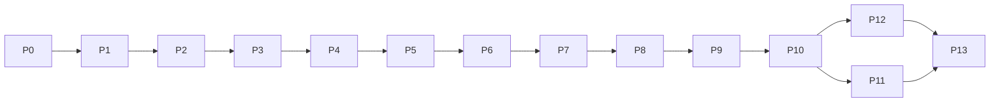

# c68k — Implementation Plan & Progress

> **Status:** Draft 0.1 (2026-07) · Companion to [architecture.md](architecture.md) and
> [libc-and-toolchain.md](libc-and-toolchain.md).
> **This is the document that tracks progress.** Update the [dashboard](#progress-dashboard) and the
> per-phase checkboxes as work lands.

The plan is **14 phases, P0–P13**. Each phase has an objective, a task checklist, explicit **exit
criteria**, and its dependencies. Phases are ordered so that every phase ends at a **runnable,
testable** milestone — bring-up reaches "hello world on both OSes" early (P4–P5), then breadth
(P6–P7), then self-hosting (P8–P10), then hardening and speed (P11–P13).

Legend: ☐ not started · ◐ in progress · ☑ done.

---

## Progress dashboard

| Phase | Title | Status | Tasks | Milestone |
| --- | --- | :---: | :---: | --- |
| **P0** | [Scaffolding & host baseline](#p0--scaffolding--host-baseline) | ☑ | 6 / 6 | chibicc forks in, builds & self-hosts on host |
| **P1** | [ILP32 type-model retarget](#p1--ilp32-type-model-retarget) | ☑ | 6 / 6 | front end is big-endian ILP32 |
| **P2** | [68000 code generation](#p2--68000-code-generation) | ☑ | 8 / 8 | C runs on bare 68000 under sim68k |
| **P3** | [Runtime support library](#p3--runtime-support-library) | ☑ | 6 / 6 | float / `long long` math correct |
| **P4** | [libc core + Osiris backend](#p4--libc-core--osiris-backend) | ☑ | 7 / 7 | **`HELLO.PRG` runs on Osiris** |
| **P5** | [CP/M-68K backend](#p5--cpm-68k-backend) | ◐ | 6 / 7 | **`HELLO.68K` runs on CP/M-68K; lockstep** |
| **P6** | [C99 language completeness](#p6--c99-language-completeness) | ☐ | 0 / 6 | language suite green on both OSes |
| **P7** | [C99 standard library](#p7--c99-standard-library) | ☐ | 0 / 7 | library + `libm` suite green |
| **P8** | [Integrated object emitter](#p8--integrated-object-emitter) | ☐ | 0 / 5 | compiler emits ELF `.o` with no assembler |
| **P9** | [Native LINK / LIB / mkdri](#p9--native-link--lib--mkdri) | ☐ | 0 / 6 | native link chain on both OSes |
| **P10** | [Self-hosting bootstrap](#p10--self-hosting-bootstrap) | ☐ | 0 / 5 | **stage2 == stage3 on both OSes** |
| **P11** | [Cross-compiler hardening](#p11--cross-compiler-hardening) | ☐ | 0 / 6 | cross is a CI'd, maintained product |
| **P12** | [Optimization](#p12--optimization) | ☐ | 0 / 6 | register allocation + peephole |
| **P13** | [Tooling & debug polish](#p13--tooling--debug-polish) | ☐ | 0 / 6 | DWARF, diagnostics, samples, SDK docs |
| | **Total** | **2 / 14** | **12 / 87** | |

**Milestones (headline):**

1. **M1 — Bare-metal C** (end P2): compiled C executes correctly on the 68000 under `sim68k`. **✅ reached** — 17-case golden suite green (`tools/m68k/run-tests.ps1`).
2. **M2 — Hello, both OSes** (end P5): the same C source builds and runs as a `.PRG` on Osiris and a
   `.68K` on CP/M-68K, verified in lockstep. **✅ reached** — hello / filerw / printftest 3/3 lockstep (`tools/run-lockstep.ps1`).
3. **M3 — Conforming C99** (end P7): the language + hosted library suites pass on both OSes.
4. **M4 — Self-hosting** (end P10): the native `CC` recompiles itself to a byte-identical binary on
   both OSes.
5. **M5 — Product** (end P11): the cross-compiler is hardened, CI-gated, and building real tools.

---

## P0 — Scaffolding & host baseline

**Objective:** fork chibicc into the repo, establish the build, and confirm the compiler builds on
the maintainers' hosts (**Windows/MSVC** and **macOS/Clang**) with an x86-64 **Linux CI** job kept
as a full-suite + self-host safety net.

- [x] Import chibicc into `src/`, **preserving its MIT copyright/notices** ([LICENSE](../LICENSE)).
      Imported verbatim at upstream commit `90d1f7f`; provenance in [`src/README.md`](../src/README.md),
      license in [`src/CHIBICC-LICENSE`](../src/CHIBICC-LICENSE).
- [x] Create the [repository layout](architecture.md#11-repository-layout) (`src`, `libc`, `lib`,
      `tools`, `tests`, `include`, `samples`).
- [x] `makefile` + `CMakeLists.txt` build `c68k` — **Windows (MSVC)**, **macOS (Clang)**, and
      **Linux (GCC/Clang)**. A thin [`src/compat.{h,c}`](../src/compat.c) platform layer supplies the
      POSIX shims MSVC lacks (`fork`/`spawn`, `open_memstream`, `strndup`, `dirname`/`basename`,
      `mkstemp`, `ctime_r`, case-compare); this is the one deliberate change to the imported baseline.
- [x] Bring chibicc's own test suite over (imported into `tests/`); it passes on x86-64 **Linux**
      unchanged — **green in CI** (gcc + clang). *(Execution tests are Linux-only: the interim x86-64
      back end can't assemble/link on Windows or macOS, where P0 instead runs `make smoke` / a
      front-end check — `-E`/`-S`/`--help`.)*
- [x] Confirm the compiler **self-hosts** (stage2 == stage3) as the baseline — `make selfhost`
      byte-compares the two stages; **green in CI** (gcc + clang).
- [x] CI skeleton: build + test on every commit ([`.github/workflows/ci.yml`](../.github/workflows/ci.yml))
      — Linux (full suite + self-host), macOS (build + front-end), Windows/MSVC (build + front-end).

**Exit:** `c68k` builds on Windows/MSVC + macOS/Clang; the front end runs there; the full conformance
suite and stage2==stage3 self-host pass on the Linux CI safety net.
**Depends on:** —

> **Host strategy (P0 decision).** The cross-compiler is built and maintained on **Windows (MSVC)**
> and **macOS (Clang)** — the tools actually in use. chibicc's *interim* x86-64 back end emits
> Linux/ELF assembly and shells out to GNU `as`/`ld`, so full execution + self-host only run on
> x86-64 **Linux**, which is retained as a **CI-only** correctness net. Once the **68000** back end
> lands (P2+), real execution testing happens under `sim68k` with the `m68k-elf` toolchain on every
> host, and the x86-64 vestige is retired. **Status: P0 CI is green on all three hosts** — Linux
> (full conformance suite + stage2==stage3 self-host, gcc + clang), macOS (build + front-end), and
> Windows/MSVC (build + front-end).

## P1 — ILP32 type-model retarget

**Objective:** convert the front end from chibicc's LP64 to **big-endian ILP32**
([architecture.md §7.1](architecture.md#71-type-model-ilp32-big-endian)).

- [x] `type.c`: sizes/alignments → `int`/`long`/pointer = 4, `short` = 2, `long long` = 8,
      `double` = 8, natural even alignment. **Alignment = 2 bytes** for every type ≥ 16 bits (the GNU
      m68k-elf SysV default; verify vs Osiris `abi-68k.md`). `long` and `long long` are now **distinct**
      (chibicc conflated them at 8 bytes on LP64).
- [x] Big-endian struct/bitfield layout — bitfields allocate MSB-first (`parse.c`). *(Runtime bit
      placement + big-endian data encoding are verified in P2 under `sim68k`, with the 68000 back end.)*
- [x] Integer-constant (`L`/`LL`/`U` + value-based promotion), `sizeof`, `_Alignof`, and
      usual-arithmetic-conversion rules on ILP32.
- [x] Predefined macros: dropped the x86-64/Linux set; added `__m68k__`, `__BYTE_ORDER__=BIG`,
      ILP32 `__SIZEOF_*__`, and the `__INT_MAX__`/`__LONG_MAX__` family.
- [x] `<limits.h>`/`<stdint.h>` added for ILP32; `<stddef.h>` verified (`size_t`/`ptrdiff_t` = 4).
- [x] Type/size unit test [`tests/typemodel.c`](../tests/typemodel.c) — a **compile-time** battery
      (`#if`/`#error` + GNU case-range asserts) run via `make type-check` on **every host** (no
      assembler/linker/execution). Passes locally on the MSVC build.

**Exit:** front end reports correct ILP32-BE sizes/offsets/limits; type tests pass on host.
**Depends on:** P0

> **P1 note.** Flipping to ILP32 makes the interim x86-64 back end non-runnable (pointers are 4 vs 8
> bytes), so the x86-64 conformance suite + self-host are retired here — replaced in CI by the
> compile-time `type-check` (build + smoke + type-model on Linux/macOS/Windows). Real execution
> testing returns in **P2** under `sim68k` with the 68000 back end.

## P2 — 68000 code generation

**Objective:** replace `codegen.c` with a **68000** generator emitting assembly text; run compiled C
on the bare CPU under `sim68k`.

- [x] `codegen68k.c`: stack-machine lowering (accumulator = `D0`, spill via `-(SP)`).
- [x] The **m68k C ABI** ([architecture.md §7.2](architecture.md#72-calling-convention--abi)):
      stack args, `D0(:D1)` return, `D2–D7/A2–A6` callee-saved, `A6` frame via `LINK`/`UNLK`.
      _(Integer scope: only caller-saved `D0/D1/A0/A1` are used, so callee-saved regs are honored
      trivially; 64-bit `D0:D1` return lands with `long long` in P3.)_
- [x] Integer arithmetic, comparisons, logical/bitwise, shifts (helper calls where needed).
- [x] Control flow: `if`/`for`/`while`/`switch`/`goto`, `&&`/`||`, `?:`.
- [x] Pointers, arrays, structs/unions, member access, aggregate copy. _(Struct/union **by-value**
      args & return use a hidden result-buffer pointer at `8(a6)`; aggregate copy is byte-wise.)_
- [x] PC-relative addressing for code/data; even-alignment enforcement.
- [x] Emit Motorola-syntax `.s`; assemble with **`asm68K`** (`/elf`); link a freestanding test (GNU
      `m68k-elf-ld`) with a minimal stub.
- [x] `sim68k` bare-metal harness captures a result register / memory and diffs to golden.
      _(11-case golden suite in [`tests/m68k/`](../tests/m68k) via
      [`tools/m68k/run-tests.ps1`](../tools/m68k/run-tests.ps1); all green.)_

**Exit (M1):** arithmetic, control-flow, function-call, and struct tests run correctly on the 68000
under `sim68k`.
**Depends on:** P1

## P3 — Runtime support library

**Objective:** the helper library the generator calls
([libc-and-toolchain.md §5](libc-and-toolchain.md#5-the-runtime-support-library)).

- [x] 32-bit integer helpers: `__mulsi3`, `__divsi3`/`__udivsi3`, `__modsi3`/`__umodsi3`, shifts.
      _(mul/div/mod in [`rt68k.a68`](../lib/runtime/rt68k.a68); 32-bit shifts emit the 68000's own
      register-count `asl/lsr/asr` inline — no helper needed.)_
- [x] 64-bit `long long`: `__muldi3`, `__divdi3`/`__udivdi3`, `__moddi3`, shifts, compares.
      _(`rt68k.a68`: `__muldi3` via a 16×16 `umul64`, 64-iteration `udivmod64`, `__ashldi3`/`__ashrdi3`/
      `__lshrdi3`, `__cmpdi2`/`__ucmpdi2`; add/sub/logical inline via `addx`/`subx`.)_
- [x] Soft **single** float: add/sub/mul/div/compare/convert.
- [x] Soft **double** float: add/sub/mul/div/compare/convert/extend/truncate (big-endian word order).
      _(Both provided by the worm68k **IEEE754** library `libieee754d.a` — C-stack ABI, pure 68000,
      PIC; the codegen lowers float/double ops and conversions to its `_fpadd`/`_fpaddd`/`_fpltof`/…
      entries. **TODO:** vendor/build the IEEE754 source into c68k's own `librt` for a self-owned,
      Osiris/CP/M-linkable runtime. `long long`↔`float` conversions are deferred, the lib has no
      64-bit int convert.)_
- [x] `memcpy`/`memset` fast paths + struct-copy thunks. _(`_memcpy`/`_memset`/`_memmove` in
      `rt68k.a68`; aggregate copy is emitted inline by the code generator.)_
- [x] Numeric tests vs. host `double`/`long long` golden values (both OSes once P4/P5 land).
      _(20 golden cases in [`tests/m68k/`](../tests/m68k): `ll_*`, `f_*`, `d_*`, `fd_conv` — all green
      under `sim68k`.)_

**Exit:** float and `long long` programs compute results matching host golden.
**Depends on:** P2

## P4 — libc core + Osiris backend

**Objective:** the OS-independent core + the **Osiris** seam and `crt0`; a real `.PRG` runs on
Osiris under `sim68k`.

- [x] Osiris seam over DOS `TRAP #1` ([libc-and-toolchain.md §3](libc-and-toolchain.md#3-the-syscall-seam)).
      _(`libc/osiris/osiris_sys.a68`: write/read/open/creat/close/seek/unlink/exit/sbrk over TRAP #1.)_
- [x] `crt0.osiris` (relocs/argv/heap/`_exit` via `4Ch`). _(`_start` in `osiris_sys.a68`: DOS 48h arena
      claim, stack+heap, `main`, exit via 4Ch; loader applies the R_68K_RELATIVE relocs & zero-fills
      bss. argv is minimal (argc=1) — full command-tail parsing is a refinement.)_
- [x] Core `<string.h>`, `<ctype.h>`, `<stdlib.h>` (`malloc` over `_sbrk`), `<errno.h>`.
      _([`libc/core/libc.c`](../libc/core/libc.c) + [`libc/include/`](../libc/include); malloc is a
      bump allocator over `sys_sbrk`.)_
- [x] Core `<stdio.h>`: buffered `FILE`, `printf`/`fwrite`/`fopen`/`fread`/`fseek`. _(Buffered `FILE`,
      `fopen`/`fclose`/`fread`/`fwrite`/`fgets`/`fputs`/`puts`/`fseek`, and the `printf` family
      (`printf`/`fprintf`/`snprintf`, integer/string/char formats incl. `%lld`) — all running on
      Osiris. m68k `va_arg` is supported (the prologue stores the first stack vararg in `__va_area__`;
      float `%f` conversion is a later add.)_
- [x] `-target osiris` driver: assemble + link with `osiris-prg.ld` → `.PRG`.
      _(via [`tools/osiris/build-prg.ps1`](../tools/osiris/build-prg.ps1): asm68K + c68k + the osiris
      binutils `ld -pie -T osiris-prg.ld`. A c68k-internal `-target osiris` flag is a follow-up.)_
- [x] `HELLO.PRG` and a file-read/write program run correctly on Osiris under `sim68k`.
      _([`samples/hello.c`](../samples/hello.c), [`samples/filerw.c`](../samples/filerw.c) — both PASS.)_
- [x] Osiris lockstep harness (compile → run under `sim68k` → diff golden).
      _([`tools/osiris/run-osiris.ps1`](../tools/osiris/run-osiris.ps1): build → FAT12 deploy → boot
      `c68k-sim68k` → capture ACIA → assert.)_

**Exit:** `HELLO.PRG` + file-I/O programs pass on Osiris.
**Depends on:** P3

## P5 — CP/M-68K backend

**Objective:** the **CP/M-68K** seam, FCB shim, and `crt0`; the same programs run as `.68K`, and the
suite goes **lockstep** across both OSes.

- [x] CP/M seam over BDOS `TRAP #2`, incl. the FCB/record/DMA→byte-stream shim.
      _([`libc/cpm/cpm.c`](../libc/cpm/cpm.c): fd→FCB table, 128-byte record buffering with `F_DMAOFF`,
      sequential `F_READ`/`F_WRITE`, `^Z`-padded close; console via BDOS 6. BDOS primitive +
      crt0 in [`libc/cpm/cpm_sys.a68`](../libc/cpm/cpm_sys.a68).)_
- [x] `crt0.cpm` (base-page cmd tail → `argv`, TPA heap/stack, BDOS-0 exit). _(`_start`: discard
      return-to-CCP, capture base page, stack at `HIGHTPA`, zero bss, heap above bss, `main`, BDOS 0.
      argv minimal (argc=1).)_
- [x] `errno` mapping for CP/M status codes; console-routed `stdin/stdout/stderr`. _(fds 0/1/2 route to
      the BDOS console; `errno` is set at the libc layer on failures. A per-code BDOS→errno table is a
      refinement.)_
- [x] `-target cpm` driver: link with `cpm68k.ld`, then `mkdri` → `.68K`. _(via
      [`tools/cpm/build-68k.ps1`](../tools/cpm/build-68k.ps1): `ld -T cpm68k.ld -Ttext 0x500` +
      `mkdri -b500`. A c68k-internal `-target cpm` flag is a follow-up.)_
- [x] `HELLO.68K` + file-I/O run correctly on CP/M-68K under `sim68k`. _([`tools/cpm/run-cpm.ps1`](../tools/cpm/run-cpm.ps1):
      `cpmcp` deploy to D:, boot `c68k-sim68k`, run — hello + filerw both PASS.)_
- [x] Lockstep runner: every test compiled for **both** OSes, one golden file, both must match.
      _([`tools/run-lockstep.ps1`](../tools/run-lockstep.ps1): hello / filerw / printftest — **3/3
      identical on Osiris and CP/M-68K**.)_
- [ ] Port the P0–P4 tests into the lockstep suite. _(3 representative console cases are in lockstep;
      the bare-metal P2/P3 return-code tests need console-output wrappers to join it.)_

**Exit (M2): ✅ reached** — the same C source runs as `.PRG` (Osiris) and `.68K` (CP/M-68K) with matching output.
**Depends on:** P4

## P6 — C99 language completeness

**Objective:** close remaining C99 language gaps and prove them on both OSes.

- [ ] Full initializer support (designated initializers, compound literals, nested aggregates).
- [ ] Flexible array members, `_Bool`, `restrict`/`inline` semantics, `long long` everywhere.
- [ ] Variadic functions end-to-end on the m68k ABI (`<stdarg.h>` `va_*`).
- [ ] VLAs / variably-modified types (or a documented, tested exclusion).
- [ ] Bitfield edge cases on big-endian ILP32.
- [ ] A C99 language conformance battery, green on both OSes.

**Exit (M3a):** language suite passes lockstep on both OSes.
**Depends on:** P5

## P7 — C99 standard library

**Objective:** complete the hosted-subset library + `libm`
([libc-and-toolchain.md §9](libc-and-toolchain.md#9-c99-library-conformance-scope)).

- [ ] `printf`/`scanf` full conversion coverage (incl. `%lld`, `%f`/`%g`, `%p`, width/precision/flags).
- [ ] `<stdlib.h>` breadth: `strtol`/`strtoul`/`strtod`, `qsort`/`bsearch`, `rand`, `div`/`ldiv`.
- [ ] `<string.h>` full set; `<time.h>` formatting over the seam clock.
- [ ] `<math.h>` via a ported `libm` donor (openlibm/fdlibm/picolibc) on soft-float.
- [ ] `<inttypes.h>`, `<stdint.h>`, `<float.h>` completeness; `<assert.h>`, `<signal.h>` (minimal).
- [ ] Freestanding mode (`-ffreestanding`) validated (headers-only + runtime lib).
- [ ] Library conformance suite, green lockstep on both OSes.

**Exit (M3):** hosted library + `libm` suites pass lockstep on both OSes.
**Depends on:** P6

## P8 — Integrated object emitter

**Objective:** emit **ELF32-BE relocatable objects directly**, removing the external-assembler
dependency ([architecture.md §8](architecture.md#8-object-emission-text-asm-now-integrated-elf-later)).

- [ ] `emit_elf.c`: ELF32-BE object writer (headers, `.text`/`.data`/`.bss`/`.rodata`, symtab, strtab).
- [ ] 68000 instruction **binary encoder** shared with the text path's instruction selection.
- [ ] Relocation records: `R_68K_32`, `R_68K_PC16`/`PC32`, `R_68K_RELATIVE` as needed.
- [ ] `-c` integrated-emit mode in the driver.
- [ ] **Byte-diff** integrated objects vs. `m68k-elf-as` across the whole corpus; links must match.

**Exit:** the compiler produces linkable objects with **no assembler**; validated against `as`.
**Depends on:** P7

## P9 — Native LINK / LIB / mkdri

**Objective:** a **native** link/archive chain on both OSes
([libc-and-toolchain.md §7](libc-and-toolchain.md#7-the-native-toolchain)).

- [ ] Verify Osiris `LINK.PRG` / `LIB.PRG` consume c68k objects/archives; wire the native recipe.
- [ ] Port `LINK` to CP/M-68K (`LINK.68K`) — file I/O moved to BDOS FCBs.
- [ ] Port `LIB` to CP/M-68K (`LIB.68K`).
- [ ] Build `mkdri` as a native `.68K` (or confirm the host path) for the CP/M final step.
- [ ] Native recipes: Osiris `CC→LINK→.PRG`; CP/M `CC→LINK→mkdri→.68K`.
- [ ] A multi-object + archive program links natively on both OSes and runs under `sim68k`.

**Exit:** native linking/archiving builds real (multi-TU) programs on both OSes.
**Depends on:** P8

## P10 — Self-hosting bootstrap

**Objective:** the native compiler compiles **its own source** to a byte-identical binary.

- [ ] Cross-compile the compiler for m68k → `CC.PRG` / `CC.68K` (stage2).
- [ ] Run `CC` under `sim68k` to compile its own source → stage3.
- [ ] **stage2 == stage3** (byte-identical) on **both** OSes.
- [ ] Fit/perf pass: the native compiler runs within a realistic Osiris/CP/M memory budget.
- [ ] Make the three-stage check a permanent CI gate.

**Exit (M4):** `CC` self-hosts to a byte-identical binary on both OSes.
**Depends on:** P9

## P11 — Cross-compiler hardening

**Objective:** treat the cross-compiler as a **maintained product** for building any Osiris/CP/M-68K
tool.

- [ ] Driver/option parity (`-c`/`-S`/`-o`/`-I`/`-D`/`-L`/`-l`/`-O`/`-g`/`-target`/`-ffreestanding`).
- [ ] Robust diagnostics (carets, notes, sane messages) and exit codes.
- [ ] Packaging/install for host OSes; documented invocation.
- [ ] CI **matrix**: build cross + run the **full lockstep suite** on both OSes per commit.
- [ ] Build a **real external tool** (e.g. an Osiris/CP/M utility) with c68k as a proof.
- [ ] SDK usage docs for third-party programs.

**Exit (M5):** cross-compiler is CI-gated, packaged, and building real programs for both OSes.
**Depends on:** P10 (usable earlier; hardened here)

## P12 — Optimization

**Objective:** move beyond the stack machine to reasonable code quality — **without** regressing
correctness.

- [ ] Temporary/register allocator: keep hot values in `D2–D7`/`A2–A5`, spill on pressure.
- [ ] Peephole pass (kill push/pop pairs, redundant moves, `tst` after arithmetic).
- [ ] Constant folding/propagation and strength reduction in the back end.
- [ ] 68000 addressing-mode selection (indexed/PC-relative/`Dn` predecrement) for common patterns.
- [ ] `-O` levels; size vs. speed knobs.
- [ ] Full suite still green lockstep; record size/speed deltas.

**Exit:** measurable size/speed improvement; all tests still pass on both OSes.
**Depends on:** P10

## P13 — Tooling & debug polish

**Objective:** debuggability and developer experience.

- [ ] DWARF (or a `sim68k`-friendly) line/symbol info; `-g`.
- [ ] Assembly listings and link map output.
- [ ] Diagnostic quality pass (warnings set, `-W` flags).
- [ ] `samples/` gallery building for both OSes.
- [ ] Finalize the SDK docs; per-phase changelogs reconciled.
- [ ] Source-level debugging demonstrated under `sim68k` / `m68k-elf-gdb`.

**Exit:** compiled programs are source-debuggable; docs and samples complete.
**Depends on:** P11, P12

---

## Dependency graph

## How to update this document

1. Flip the task checkbox (`[ ]`→`[x]`) as each task lands.
2. Update the phase **Status** (☐/◐/☑) and its **Tasks n / N** count in the
   [dashboard](#progress-dashboard).
3. Update the **Total** row (`x / 14` phases, `n / 87` tasks).
4. When a milestone's phase closes, note it in the phase changelog and here.

---

### Changelog

| Date | Version | Change |
| --- | --- | --- |
| 2026-07 | Draft 0.1 | Initial 14-phase plan (P0–P13), progress dashboard, milestones, dependency graph. |
| 2026-07 | Draft 0.1 | P0 scaffolding landed: chibicc imported (unmodified, commit `90d1f7f`) into `src/`; repo layout created; `Makefile` + `CMakeLists.txt` host build; conformance suite in `tests/`; `selfhost` stage2==stage3 check; GitHub Actions CI. Test-green + self-host verification run on Linux CI (dev host is Windows/MSVC-only). |
| 2026-07 | Draft 0.1 | P0 host strategy revised (decision D11): build the cross-compiler on **Windows/MSVC** + **macOS/Clang** via a new `src/compat.{h,c}` POSIX/Win shim; Linux becomes a CI-only full-suite + self-host safety net; Windows/macOS CI run a front-end smoke check. MSVC `cl` build + front end verified locally on Windows. |
| 2026-07 | Draft 0.1 | **P0 complete (6/6).** CI green on all three hosts: Linux full conformance suite + `stage2==stage3` self-host (gcc + clang), macOS + Windows/MSVC build + front-end smoke. Landing fixes: `tests/` path-rename stragglers, `driver.sh` exec bit + `.gitattributes` LF, `actions/checkout@v5` (Node 24), and `-Iinclude` for the relocated stage2/stage3 self-host. |
| 2026-07 | Draft 0.1 | **P1 complete (6/6).** Front end retargeted to big-endian ILP32: `type.c` sizes/alignments (2-byte, the m68k-elf default), a `long` vs `long long` split, big-endian bitfields, ILP32 integer-literal typing, m68k/big-endian predefined macros, and new `<limits.h>`/`<stdint.h>`. Verified by a compile-time `tests/typemodel.c` (`make type-check`) on every host. The non-runnable x86-64 back end's execution + self-host CI is retired until P2 (`sim68k`). |
