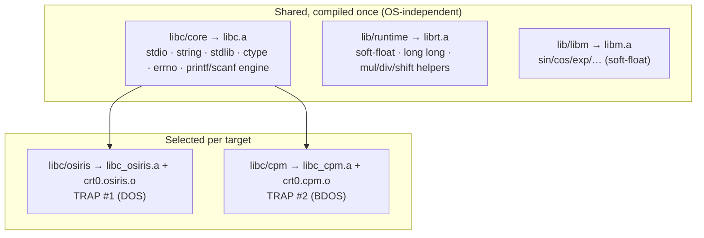
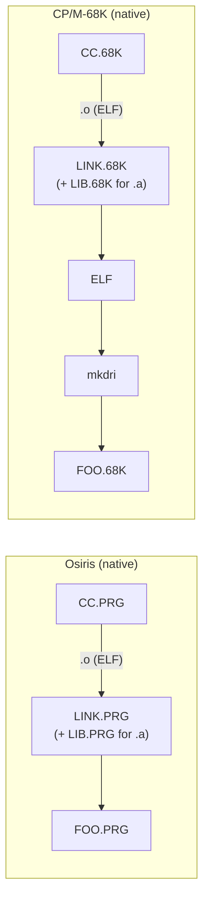

# c68k — C Library & Native Toolchain

> **Status:** Draft 0.1 (2026-07) · Companion to [architecture.md](architecture.md) and
> [implementation-plan.md](implementation-plan.md).

This document specifies **where the platform split lives** — the C standard library — and the
**native toolchain** used to link and archive on the two targets. The compiler itself is
OS-agnostic ([architecture.md §6](architecture.md#6-dual-target-strategy-one-back-end-split-in-the-c-library));
everything OS-specific is here.

## Table of contents

1. [Library structure](#1-library-structure)
2. [The OS-independent core](#2-the-os-independent-core)
3. [The syscall seam](#3-the-syscall-seam)
4. [`crt0` — per-OS startup](#4-crt0--per-os-startup)
5. [The runtime support library](#5-the-runtime-support-library)
6. [The math library](#6-the-math-library)
7. [The native toolchain](#7-the-native-toolchain)
8. [Build recipes](#8-build-recipes)
9. [C99 library conformance scope](#9-c99-library-conformance-scope)

---

## 1. Library structure

The C library is **three layers**: an OS-independent core, a thin per-OS **seam**, and a per-OS
**`crt0`**. A program links exactly one seam + one `crt0` (chosen by `-target osiris` or
`-target cpm`) plus the shared core, runtime, and math libraries.



| Component | Path | Built for | Contents |
| --- | --- | --- | --- |
| Core | `libc/core/` | both (once) | OS-independent C99 hosted subset |
| Osiris seam + crt0 | `libc/osiris/` | Osiris | DOS `TRAP #1` primitives, `crt0.osiris` |
| CP/M seam + crt0 | `libc/cpm/` | CP/M-68K | BDOS `TRAP #2` primitives, `crt0.cpm` |
| Runtime support | `lib/runtime/` | both (once) | soft-float, 64-bit `long long`, int helpers |
| Math | `lib/libm/` | both (once) | `<math.h>` over soft-float |
| Headers | `libc/include/` | both | the C standard headers |

## 2. The OS-independent core

`libc/core/` is the bulk of the library and **never issues a `TRAP`** — it reaches the OS only by
calling seam functions ([§3](#3-the-syscall-seam)). It is compiled once and linked into both
targets.

- **`<stdio.h>`** — `FILE` streams with buffering, `fopen`/`fread`/`fwrite`/`fclose`/`fseek`,
  `fgetc`/`fputc`/`fgets`/`fputs`, and the **`printf`/`scanf` family** over one shared
  format engine. All byte movement bottoms out in `_sys_read`/`_sys_write`.
- **`<string.h>`**, **`<ctype.h>`**, **`<stdlib.h>`** (`malloc`/`free`/`realloc` over `_sbrk`,
  `atoi`/`strtol`/`qsort`/`bsearch`/`abs`/`div`, `rand`), **`<errno.h>`**, **`<assert.h>`**,
  **`<stdarg.h>`** glue, **`<limits.h>`**/**`<stdint.h>`**/**`<stddef.h>`** (ILP32 values),
  **`<time.h>`** formatting (clock source is a seam call).
- **`malloc`** is a simple **bump allocator** over `_sbrk` (`free` is a no-op; only the most-recent
  block is reclaimable, via `realloc`/arena release); the OS difference (how the heap grows) is
  entirely inside `_sbrk` in the seam.

## 3. The syscall seam

The seam is the **only** place OS `TRAP`s appear. It is a small, fixed set of primitives; the core
library is written against these signatures and is identical for both OSes. Each primitive has an
**Osiris** implementation (`libc/osiris/`) over DOS `TRAP #1`
([abi-68k.md §3](../../osiris/docs/abi-68k.md), function code in `D0.W` high byte, carry-set =
error) and a **CP/M-68K** implementation (`libc/cpm/`) over BDOS `TRAP #2` (function in `D0.W`,
argument in `D1.L`, result in `D0.L`).

| Seam primitive | Purpose | **Osiris** (DOS `TRAP #1`) | **CP/M-68K** (BDOS `TRAP #2`) |
| --- | --- | --- | --- |
| `_sys_conout(c)` | write one char to console | `02h` (`D3.b`=char) | `2` (Console Output) |
| `_sys_conin()` | read one char (blocking) | `01h`/`08h` | `1` (Console Input) |
| `_sys_constat()` | console input ready? | `0Bh` | `11` (Console Status) |
| `_sys_open(path,mode)` | open existing file | `3Dh` (`A0`=path,`D0.b`=mode) → `D0.W` handle | `15` Open (FCB) — seam packs the FCB |
| `_sys_creat(path,attr)` | create/truncate file | `3Ch` (`A0`=path,`D2`=attr) → handle | `22` Make (FCB) |
| `_sys_close(fd)` | close file | `3Eh` (`D1.W`=handle) | `16` Close (FCB) |
| `_sys_read(fd,buf,n)` | read bytes | `3Fh` (`D1`=h,`D2`=n,`A0`=buf) → `D0.W` got | `20`/`33` Read Seq/Random over DMA |
| `_sys_write(fd,buf,n)` | write bytes | `40h` (`D1`=h,`D2`=n,`A0`=buf) → `D0.W` put | `21`/`34` Write Seq/Random over DMA |
| `_sys_seek(fd,off,whence)` | reposition | `42h` (`D1`=h,`D0.b`=method,`D3.L`=off) → `D0.L` | random-record calc + `33`/`34` |
| `_sys_unlink(path)` | delete file | `41h` (`A0`=path) | `19` Delete (FCB) |
| `_sys_rename(old,new)` | rename file | `56h` (`A0`=old,`A1`=new) | `23` Rename (FCB) |
| `_sys_sbrk(delta)` | grow/shrink heap | `48h`/`4Ah` (alloc/resize, `D1.L`=bytes) | advance break within the TPA (base-page limits) |
| `_sys_time(&t)` | wall clock / ticks | `2Ah`+`2Ch` (get date + time) | `T`-function / BIOS tick; format in core |
| `_sys_exit(code)` | terminate process | `4Ch` (`D0.b`=code) or `TRAP #3` | `0` (System Reset) |
| `_sys_args(argv,env)` | fetch cmd line / env | from PSP-equivalent + `64h` env | from base-page command tail |

Notes:

- **File model impedance.** Osiris is **handle-based** (a small integer `fd` maps directly). CP/M-68K
  is **FCB + record/DMA**: the CP/M seam owns a table that maps an `fd` to an FCB, packs 8.3 names,
  sets the DMA address (`26`), and translates byte offsets into 128-byte record reads/writes with a
  buffer so that `stdio`'s byte-stream contract holds. This shim lives entirely in `libc/cpm/`.
- **`errno`.** Osiris returns carry-set + `D0.W` = a DOS error code; CP/M returns status in `D0.L`.
  Each seam maps the native code to a C `errno` value; the mapping table is per-OS.
- **Standard handles.** `stdin`/`stdout`/`stderr` are fds `0/1/2` on Osiris; on CP/M the seam routes
  them to the console primitives (there is no handle 0/1/2), so `_sys_read(0,…)`/`_sys_write(1,…)`
  dispatch to `_sys_conin`/`_sys_conout` with line buffering.

Keeping the seam at ~15 functions is a deliberate constraint: it is the whole cost of adding a
*third* OS later, and it is the only code that must be re-verified when either OS's ABI changes.

## 4. `crt0` — per-OS startup

`crt0` is the assembly/C stub the linker places at the image entry point. It establishes the C
environment, calls `main`, and terminates. One `crt0` per OS.

### `crt0.osiris`

1. Entry at the ELF entry point; the loader has mapped the `.PRG` and (as a static-PIE) applied
   `R_68K_RELATIVE` fixups. If a configuration ships images the loader does *not* pre-relocate,
   `crt0` walks the relocation table itself before touching global pointers.
2. Set `A6`/`A7` frame + stack; zero `.bss`.
3. Establish the heap base for `_sbrk` (one `48h` allocation of the free region, or the loader's
   reported top of memory).
4. Marshal the command line from the PSP-equivalent into `argc`/`argv[]`; expose the environment
   (`64h`).
5. `main(argc, argv, envp)` → call `exit(rc)` → `_sys_exit` (`4Ch`).

### `crt0.cpm`

1. Entry with `A6` → **base page**; read `m_tbase/m_dbase/m_bbase` and the free-memory top.
2. Zero `.bss`; set stack near the top of the TPA; set the `_sbrk` break just above `.bss`, growing
   toward the stack (no OS heap call — the TPA *is* the heap).
3. Parse the **base-page command tail** into `argc`/`argv[]`; the two default FCBs remain available.
4. Set the DMA address for the file shim.
5. `main(...)` → `exit(rc)` → BDOS `0`.

## 5. The runtime support library

`lib/runtime/` (→ `librt.a`) holds the compiler's helper routines — code the generator *calls*
because the base 68000 lacks the instruction. It is **OS-independent**. Symbol names follow the
`libgcc`/EABI convention so the generator's calls are conventional and donor code can be reused.

| Group | Examples | Why |
| --- | --- | --- |
| **32-bit integer** | `__mulsi3`, `__divsi3`, `__udivsi3`, `__modsi3`, `__umodsi3`, `__ashlsi3`, `__ashrsi3`, `__lshrsi3` | The 68000 `MULS/MULU/DIVS/DIVU` are 16-bit; 32-bit and variable shifts need helpers. |
| **64-bit `long long`** | `__muldi3`, `__divdi3`, `__udivdi3`, `__moddi3`, `__ashldi3`, `__cmpdi2` | No 64-bit unit at all. |
| **Soft single (`float`)** | `__addsf3`, `__subsf3`, `__mulsf3`, `__divsf3`, `__cmpsf2`, `__fixsfsi`, `__floatsisf` | No FPU on the base 68000. |
| **Soft double (`double`)** | `__adddf3`, `__subdf3`, `__muldf3`, `__divdf3`, `__cmpdf2`, `__fixdfsi`, `__floatsidf`, `__extendsfdf2`, `__truncdfsf2` | IEEE-754 double in software. |
| **Memory helpers** | `memcpy`/`memset` fast paths, struct-copy thunks | Emitted for aggregate copies/initializers. |

- **Soft-float source.** Adapt a proven, permissively licensed implementation (Berkeley
  **SoftFloat**-style, or the routines shipped with **picolibc**/**libgcc**) to ILP32 big-endian.
  Big-endian storage means the `double` word order in the `D0:D1` return pair is MSW-first — the
  helpers and the generator must agree on that layout.
- **Optional hardware FPU.** A future `-m68881` mode would emit `F...` opcodes and drop the
  soft-float helpers for `float`/`double`; not a P0 goal.

## 6. The math library

`lib/libm/` (→ `libm.a`) supplies `<math.h>` (`sin`, `cos`, `tan`, `exp`, `log`, `pow`, `sqrt`,
`floor`, `ceil`, `fabs`, `fmod`, …) built **on the soft-float runtime**, and is OS-independent.
Source it from a permissive donor — **openlibm**, **fdlibm**, or **picolibc's libm** — and port to
ILP32 big-endian soft-`double`. `libm` is optional at link time (`-lm`).

## 7. The native toolchain

The goal is a **native build chain on each target** that mirrors the host chain, so that
`CC.PRG`/`CC.68K` can build programs (and itself) without a host. Osiris already ships native
`LINK` and `LIB`; CP/M-68K gets **ports** of those, and both converge on `mkdri` for the final
CP/M image.

### 7.1 The assembler question

Osiris has **no native assembler**, and one is not planned. c68k resolves this by having the native
compiler **emit ELF objects directly** (the integrated emitter,
[architecture.md §8](architecture.md#8-object-emission-text-asm-now-integrated-elf-later)), so the
native pipeline is `CC → .o → LINK` with **no assembler step**. During host bring-up the
cross-compiler may still emit `.s` and use the GNU `m68k-elf-as`; the two paths produce
bit-comparable objects.

### 7.2 Linking & archiving

| Task | Host (cross) | Osiris (native) | CP/M-68K (native) |
| --- | --- | --- | --- |
| **Link** | `m68k-elf-ld` + script | **`LINK.PRG`** (existing) | **`LINK.68K`** (port of Osiris `LINK`) |
| **Archive** | `m68k-elf-ar` | **`LIB.PRG`** (existing) | **`LIB.68K`** (port of Osiris `LIB`) |
| **Link script** | `osiris-prg.ld` / `cpm68k.ld` | built-in `.PRG` layout | `cpm68k.ld` semantics |
| **Final image** | `.PRG` direct / `mkdri`→`.68K` | `.PRG` direct | `mkdri`→`.68K` |

- **Osiris native:** the existing `LINK.PRG` consumes ELF `.o`/`.a` and emits the `.PRG` directly
  (the ELF static-PIE *is* the executable). `LIB.PRG` builds `.a` archives. c68k targets these
  unchanged.
- **CP/M-68K native ports:** port `LINK` and `LIB` from their Osiris sources to run **on CP/M-68K**
  (their own file I/O moves from DOS handles to BDOS FCBs — the same seam concern as libc). The
  ported `LINK.68K` produces a linked ELF laid out per `cpm68k.ld`; **`mkdri`** (itself buildable
  as a native `.68K`) then converts it to the DRI `.68K` image. This gives CP/M-68K a fully native
  `CC → LINK → mkdri` chain matching Osiris's.
- **`mkdri`** is the ELF→`.68K` converter from the worm68k toolchain; it applies DRI relocation
  fixups and writes the base-page/segment headers CP/M-68K's loader expects.

### 7.3 Native chains, end to end



## 8. Build recipes

**Cross, Osiris target:**

```text
c68k -target osiris -c foo.c -o foo.o
m68k-elf-ld -T tools/osiris-prg.ld crt0.osiris.o foo.o \
    libc.a libc_osiris.a librt.a libm.a -o FOO.PRG      # ELF32-BE PIE == .PRG
```

**Cross, CP/M-68K target:**

```text
c68k -target cpm -c foo.c -o foo.o
m68k-elf-ld -T tools/cpm68k.ld crt0.cpm.o foo.o \
    libc.a libc_cpm.a librt.a libm.a -o foo.elf
mkdri foo.elf FOO.68K
```

**Native (Osiris):** `CC FOO.C` → `foo.o` (integrated emit) → `LINK FOO.O …` → `FOO.PRG`.
**Native (CP/M-68K):** `CC FOO.C` → `foo.o` → `LINK FOO.O …` → `foo.elf` → `MKDRI` → `FOO.68K`.

## 9. C99 library conformance scope

- **In scope (hosted subset):** `<assert.h>`, `<ctype.h>`, `<errno.h>`, `<float.h>`, `<inttypes.h>`
  (subset), `<limits.h>`, `<math.h>`, `<stdarg.h>`, `<stdbool.h>`, `<stddef.h>`, `<stdint.h>`,
  `<stdio.h>`, `<stdlib.h>`, `<string.h>`, `<time.h>` (formatting; resolution is OS-limited).
- **Reduced / best-effort:** `<locale.h>` ("C" locale only), `<signal.h>` (minimal —
  Ctrl-Break/abort only), wide-char/multibyte (`<wchar.h>`/`<wctype.h>`) minimal.
- **Out of scope initially:** `<complex.h>`, `<fenv.h>` (no FPU exceptions), `<tgmath.h>`, threads.
- **Freestanding mode** (`-ffreestanding`): only the headers a freestanding C99 impl must provide
  (`<float.h>`, `<iso646.h>`, `<limits.h>`, `<stdarg.h>`, `<stdbool.h>`, `<stddef.h>`, `<stdint.h>`)
  plus the runtime helper lib — no OS seam required, for building Osiris/CP/M components that must
  not pull in `stdio`.

Conformance is validated by the lockstep test suite
([implementation-plan.md P7](implementation-plan.md#p7--c99-standard-library)): each library test
runs on **both** OSes and must match one golden output.

---

### Changelog

| Date | Version | Change |
| --- | --- | --- |
| 2026-07 | Draft 0.1 | Initial library + toolchain design: three-layer libc, the ~15-call seam mapped to Osiris DOS & CP/M BDOS, per-OS `crt0`, runtime/soft-float lib, and the native LINK/LIB/`mkdri` chains. |
