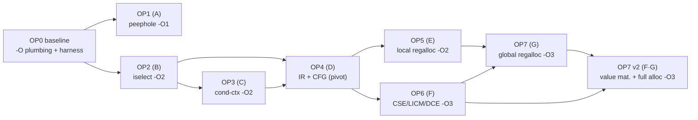

# c68k — Optimizing Compiler: Implementation Plan & Progress

> **Status:** Draft 0.1 (2026-07) · The phased program that turns the back end from a correct
> stack machine into a **full optimizing compiler**, realizing the Tier A–G roadmap and the 14-item
> Opportunity catalog of [codegen.md](codegen.md#11-optimization-roadmap).
> **This document tracks optimizer progress.** Update the [dashboard](#progress-dashboard) and the
> per-phase checkboxes as work lands. It is the optimizer companion to the whole-project
> [implementation-plan.md](implementation-plan.md) (P12/P13); the design rationale, generated-code
> analysis, and tier definitions live in [codegen.md](codegen.md).

The plan is **8 phases, OP0–OP7**. OP0 is the measurement + `-O`-level foundation; OP1–OP3 are the
single-pass wins that need no IR; **OP4 (the IR/CFG pivot)** unlocks OP5–OP7. Every phase ends at a
**measured, lockstep-green** milestone and is gated by the [design invariants](#design-invariants).

Legend: ☐ not started · ◐ in progress · ☑ done.

## Table of contents

- [c68k — Optimizing Compiler: Implementation Plan \& Progress](#c68k--optimizing-compiler-implementation-plan--progress)
  - [Table of contents](#table-of-contents)
  - [Existing baseline (`-O1` today)](#existing-baseline--o1-today)
  - [Progress dashboard](#progress-dashboard)
  - [Milestones](#milestones)
  - [`-O` level model](#-o-level-model)
  - [Design invariants](#design-invariants)
  - [Measurement \& verification](#measurement--verification)
  - [OP0 — Baseline, harness \& `-O`-level plumbing](#op0--baseline-harness---o-level-plumbing)
  - [OP1 — Tier A: Peephole \& local rewrites  ☑](#op1--tier-a-peephole--local-rewrites--)
  - [OP2 — Tier B: Local instruction selection  ☑](#op2--tier-b-local-instruction-selection--)
  - [OP3 — Tier C: Condition-context codegen  ☑](#op3--tier-c-condition-context-codegen--)
  - [OP4 — Tier D: IR + CFG (the pivot)](#op4--tier-d-ir--cfg-the-pivot)
  - [OP5 — Tier E: Local register allocation](#op5--tier-e-local-register-allocation)
  - [OP6 — Tier F: Global optimizations](#op6--tier-f-global-optimizations)
  - [OP7 — Tier G: Global register allocation](#op7--tier-g-global-register-allocation)
  - [Catalog → phase map](#catalog--phase-map)
  - [Dependency graph](#dependency-graph)
  - [How to update this document](#how-to-update-this-document)
  - [Changelog](#changelog)

---

## Existing baseline (`-O1` today)

What already exists (P12/P13 — *not* part of this plan's phases; the starting point OP1+ build on):

- **Immediate-operand folding** and **power-of-two strength reduction** for a **constant right
  operand** ([`gen_const_binop`](../src/codegen68k.c#L714)).
- A **peephole** pass (R1 address↔data round-trip, R2 dead `move.l a0,d0`, R3 `lea`+load → EA fold).
- **`moveq`/`addq`/`subq`** tightest immediate encodings; whole-function dead-code elimination;
  self-declaring imports.
- **Gated behind `-O1`**; `-O0` is byte-identical to the naive stack machine (the self-host anchor).

Measured: `CORETEST.PRG` 95,824 (`-O0`) → 78,736 (`-O1`) → **75,440 with the addressing-mode fold
(−21 %)**; full lockstep green on both OSes at `-O1`. This plan extends `-O1` (OP1) and introduces
**`-O2`** (OP2–OP3, OP5) and **`-O3`** (OP6–OP7).

---

## Progress dashboard

| Phase | Tier | Title | `-O` | Status | Tasks | Milestone |
| --- | :---: | --- | :---: | :---: | :---: | --- |
| **OP0** | — | [Baseline, harness & `-O`-level plumbing](#op0--baseline-harness--o-level-plumbing) | — | ☑ | 4 / 4 | benchmark corpus + `-O2`/`-O3` levels + gates |
| **OP1** | A | [Peephole & local rewrites](#op1--tier-a-peephole--local-rewrites) | O1 | ☑ | 4 / 4 | obvious embarrassments gone |
| **OP2** | B | [Local instruction selection](#op2--tier-b-local-instruction-selection) | O2 | ☑ | 5 / 5 | most push/pop pairs gone |
| **OP3** | C | [Condition-context codegen](#op3--tier-c-condition-context-codegen) | O2 | ☑ | 3 / 3 | comparisons branch on flags |
| **OP4** | D | [IR + CFG (the pivot)](#op4--tier-d-ir--cfg-the-pivot) | O2/O3 | ☑ | 5 / 5 | AST → IR → select → emit |
| **OP5** | E | [Local register allocation](#op5--tier-e-local-register-allocation) | O2 | ☑ | 5 / 5 | hot locals in `D2–D7`/`A2–A5`; ON by default at `-O2`+ (`-fno-regalloc` opts out) |
| **OP6** | F | [Global optimizations](#op6--tier-f-global-optimizations) | O3 | ◐ | 2 / 4 | const-prop + fold + DCE at `-O3`; CSE / LICM / IV → OP7 v2 |
| **OP7** | G | [Global register allocation](#op7--tier-g-global-register-allocation) | O3 | ◐ | 2 / 3 | liveness interference sharing at `-O3`; spill / splitting → v2 |
| **OP7 v2** | F·G | [Value materialization & full allocation](#op7-v2--value-materialization--full-allocation) | O3 | ◐ | 1 / 8 | CSE-mat / LICM / IV-SR + real spill / live-range splitting + `break`/`continue` |
| | | **Total** | | **6 / 8** | **30 / 33 core · 1 / 8 v2** | |

---

## Milestones

1. **MO1 — `-O1` polished** (end OP1) ✅: the peephole/local-rewrite embarrassments from
   [codegen.md §10.6/§10.8](codegen.md#106-redundant-epilogue-branch-and-dead-zero-init) are gone;
   measurable size cut on the corpus, `-O0` still byte-identical.
2. **MO2 — `-O2` local** (end OP3) ✅: memory-source operands, either-side constants, richer strength
   reduction, and condition-context branching — the **biggest win achievable without an IR**. The full
   lockstep passes at `-O2` on both OSes, and the byte-identical **`-O2` self-host is 13/13**
   (stage2==stage3). *(Formerly blocked by a separate, pre-existing libheap SOA `.data`-corruption bug,
   root-caused to a stale `SLAB` magic after `HeapDestroy` and fixed 2026-08-02 —
   [bugs/soa-o2-selfhost-data-corruption.md](bugs/soa-o2-selfhost-data-corruption.md).)*
3. **MO3 — IR pivot** (end OP4) ✅: codegen is **AST → IR → select → emit** at `-O2`/`-O3` **by
   default** (with a CFG and tiling instruction selection); `-O0`/`-O1` (and `-g`, `-fno-ir`) stay
   single-pass. The IR is proven **byte-neutral**: `-O2` == `-O2 -fno-ir` byte-for-byte, the `-O2`
   self-host `CC.PRG` is byte-identical with the IR on vs off, the full **lockstep is 26/26 on both
   OSes**, and **self-host stage3 is byte-identical** (2026-08-02).
4. **MO4 — `-O2` registers** (end OP5): local register allocation eliminates the
   [§10.1](codegen.md#101-everything-round-trips-through-memory-no-register-allocation) memory
   round-trips for straight-line code; callee-saved `MOVEM` prologue/epilogue.
5. **MO5 — `-O3` optimizing** (end OP7): CSE/LICM/DCE + a whole-function register allocator — a
   genuinely optimizing compiler; measurable speed + size gains, every test green on both OSes.
   *(OP6 fold/DCE + OP7 liveness-interference allocator v1 landed 2026-08-03; CSE-materialization /
   LICM / IV-SR + real spilling are the v2 follow-up — scoped as [OP7 v2](#op7-v2--value-materialization--full-allocation) tasks V1–V8.)*

---

## `-O` level model

| Level | Meaning | Phases |
| --- | --- | --- |
| **`-O0`** | Naive stack machine (default). **Byte-identical invariant** — never changes. | (baseline) |
| **`-O1`** | Immediate select, pow2 strength reduction, peephole R1–R3 + the Tier A rewrites. | existing + OP1 |
| **`-O2`** | `-O1` + Tier B local instruction selection + Tier C condition-context + Tier E local regalloc. | OP2, OP3, OP5 |
| **`-O3`** | `-O2` + Tier F global optimizations + Tier G global register allocation. | OP6, OP7 |

`-Os`/`-Oz` continue to alias the size-favoring subset (today == `-O1`); as OP2+ land they select the
size-reducing transforms (memory operands, strength reduction, DCE) while deferring speed-only,
size-neutral choices. `-Ofast` == `-O3` (no fast-math relaxations — soft-float stays IEEE-correct).
Each new level is **opt-in**; the invariant is that a lower level's output is never perturbed by a
higher level's work.

---

## Design invariants

These gate **every** phase (from [codegen.md §13](codegen.md#13-design-invariants-for-any-optimizer-work)):

1. **`-O0` stays byte-identical.** No pass may alter `-O0` output — it is the self-host
   stage2==stage3 anchor and the golden/lockstep baseline. Gate everything on `opt_level`.
2. **Dual-encoder parity.** Every new mnemonic or addressing mode must assemble identically under
   **`asm68K`** *and* the **integrated ELF emitter** (`C68K_INTEGRATED_AS=1`).
3. **Validate on both OSes.** Each change is proven by the **lockstep** suite (Osiris + CP/M-68K) and,
   for the compiler's own TUs, by **self-host byte-identity** at the levels it touches.
4. **Correctness knobs stay conservative.** Signed-division rounding, NaN-unordered float compares,
   big-endian narrow-scalar slot placement, and VLA/`setjmp` SP discipline are contracts — any
   optimization touching them carries a targeted test.
5. **Prefer shippable increments.** OP1–OP3 each stand alone; land them independently rather than
   waiting on the IR (OP4).

---

## Measurement & verification

**Benchmark corpus** (`tests/opt/` + existing programs), measured per phase:

- The [codegen.md §10](codegen.md#10-analysis-of-the-generated-code) sample
  (`add3/sum_loop/idx/cond/reuse/muldiv/cmp_chain/store_const`) — the canonical before/after.
- `samples/*` (hello, printftest, hexdump, filerw) + the lockstep programs (coretest, c99test,
  mathtest, libtest, …) — real-world integer/library code.
- A small **micro-suite** — one file per opportunity (memory operands, indexed addressing, cond
  branching, strength reduction, register reuse, CSE, LICM) — asserting the *expected instruction
  form* appears (a `grep` over the emitted asm) so a regression in a transform is caught precisely.

**Metrics:** stripped `.text` size (primary), emitted instruction count, and — where a
representative loop exists — a 68000 cycle estimate. The dashboard records the size delta vs `-O0`.

**Gates, run at each phase's `-O` level:**

- **G1 Correctness** — full **lockstep** green on both OSes at the phase's level (`C68K_OPT=<n>`).
- **G2 Invariant** — `-O0` output unchanged (byte-diff) and **self-host stage2==stage3** byte-identical
  at `-O0` (and, from MO2, at `-O2`).
- **G3 Parity** — both encoders emit identical objects for the new forms.
- **G4 Micro** — the phase's `tests/opt/` cases show the intended transform and correct results.
- **G5 No-regression** — no benchmark grows; the intended targets shrink.

CI wires G1–G4 per commit; G5 is tracked in the dashboard/changelog.

---

## OP0 — Baseline, harness & `-O`-level plumbing

**Objective:** the infrastructure every later phase needs — `-O2`/`-O3` levels, the benchmark corpus,
and the regression gates — with **zero codegen change**.

- [x] **`-O` levels.** `-O2`→2, `-O3`→3, `-Ofast`→3, `-Os`/`-Oz`→1 in
      [`main.c`](../src/main.c); numeric `opt_level` (0/1/2/3) threaded. **Verified output-neutral:**
      `-O0` unchanged, `-O1`==`-O2`==`-O3` (every gate is `opt_level >= 1`; no level-2/3 transform yet).
- [x] **Benchmark corpus + measure script.** [`tests/opt/bench.c`](../tests/opt/bench.c) +
      [`tools/opt-measure.ps1`](../tools/opt-measure.ps1) (instruction count + `.text` size at
      `-O0..-O3`, deltas vs `-O0`, optional CSV). **Baseline:** `bench.c` `-O0` **582 insns / 1042
      `.text`** → `-O1` **441 / 740** (−24 % / −29 %); `-O2`/`-O3` identical to `-O1`.
- [x] **Micro-test harness.** [`tools/opt-check.ps1`](../tools/opt-check.ps1) — grep-the-asm rules,
      the current `-O1` transforms as self-test **PASS** (4) and the OP1–OP3 targets as **PENDING**
      (7; each flips to PASS when its phase lands).
- [x] **Self-host-at-level check.** [`build-cc.ps1`](../tools/osiris/build-cc.ps1) honors
      `C68K_OPT=<n>` → builds CC.PRG at `-O<n>`. `-O2` self-host == the proven `-O1` stage2==stage3
      (output-identical today); a distinct `-O2` self-host run becomes meaningful once OP2 diverges `-O2`.

**Exit:** ✅ `-O0..-O3` build **identically** (output-neutral, host-verified — the lockstep/self-host
baselines are unchanged by construction); the corpus + measure + micro-check harnesses are in and the
baseline is recorded.
**Depends on:** the existing `-O1` tier (P12/P13).

---

## OP1 — Tier A: Peephole & local rewrites  ☑

**Objective:** cheap, low-risk local rewrites on the existing buffered stream that remove the obvious
embarrassments — **extends `-O1`**. *(Catalog #1–#3.)*

- [x] **#1 Branch-to-next / dead-after-transfer.** Peephole **R4** drops `bra L`/`bra.s L` when `L:` is
      the next line (kills every redundant `bra L_return_<fn>` before the epilogue and the trailing
      `bra L_end_N` of a linearised `if`/`&&`/`||`); **R5** deletes the unreachable instructions
      between a `bra`/`jmp`/`rts` and the next label. Both are exact local equivalences gated at
      `opt_level>=1` (`codegen68k.c` `peephole()`). *(Adjacent empty-label coalescing is cosmetic —
      labels emit 0 bytes — and is left as-is.)*
- [x] **#2 Small `MEMZERO` → unrolled `clr`.** `ND_MEMZERO` of a small object (≤ 16 B, even offset —
      every local is ≥ 2-aligned) lowers to straight-line `clr.l`/`clr.w`/`clr.b` instead of the
      `lea`+`move.w`+`clr.b`+`dbra` byte loop; a scalar `int t = …;` collapses to a single
      `clr.l d(a6)`. Gated at `opt_level>=1`; the `dbra` loop is retained at `-O0` and for large
      objects ([§10.6](codegen.md#106-redundant-epilogue-branch-and-dead-zero-init)). *(The dead-store
      half — dropping the zero-init entirely when the initializer fully covers the scalar — is left to
      DCE in OP6.)*
- [x] **#3 `__func__` duplication.** At `-O1+`, `__func__` and `__FUNCTION__` share **one** name-string
      literal instead of two identical copies per function (`parse.c` `funcdef`, gated on `opt_level`);
      halves the synthesized name-string `.data`
      ([§10.8](codegen.md#108-front-end-data-bloat)). *(Full suppression of the still-unreferenced
      literal needs data liveness — deferred.)*
- [x] Measure + gate (G1–G5); dashboard size delta updated.

**Result (bench corpus).** `-O1` **336 insns / 658 B `.text`** (was 441 / 740 at OP0): **−105 insns,
−82 B** on top of OP0, **42.3 % fewer insns than `-O0`** (582 / 1042). Synthesized name-string literals
per TU halved (4 → 2 on the two-function probe). `-O0` unchanged at **582 / 1042** — every rule is gated
at `opt_level>=1`. Micro-check `no-bra-to-next` **PASS**; full lockstep **26/26 on both OSes at `-O1`**.

**Exit (MO1):** the §10.6/§10.8 embarrassments are addressed; measurable corpus size cut; `-O0`
byte-identical. ✅
**Risk:** low — each rule a provable local equivalence; no data-flow needed.
**Depends on:** OP0.

---

## OP2 — Tier B: Local instruction selection  ☑

**Objective:** exploit the two-operand CISC — the **biggest win without an IR** — by selecting memory
operands, direct stores, either-side constants, indexed addressing, and richer strength reduction.
**Lands `-O2`** (the first level that diverges from `-O1`). *(Catalog #4–#8.)*

- [x] **#4 Memory-source operands.** A binary op whose RHS is a simple size-4 lvalue (`disp(a6)` frame
      slot or `_g` global) folds into `add.l ea,d0` / `sub.l ea,d0` / `cmp.l ea,d0` / `and.l/or.l ea,d0`
      instead of push/pop + `D1`. EOR has no `<ea>,Dn` form and stays generic
      ([§10.3](codegen.md#103-the-68000-is-a-two-operand-cisc-but-memory-operands-go-unused)). `gen_mem_binop`.
- [x] **#5 Direct store to lvalue EA.** `lval = v` for a simple scalar lvalue → `move.<sz> d0,disp(a6)`
      / `move.<sz> d0,_g` with no address push/pop (bitfields/aggregates/8-byte stay generic)
      ([§10.5](codegen.md#105-address-arithmetic-ignores-indexed-addressing-and-constant-folding)).
- [x] **#6 Constant on either side.** A constant LHS is canonicalized: commutative ops (`+ * & | ^ == !=`)
      fold via the existing fast path; `c < x` / `c <= x` emit `x > c` / `x >= c` with the reversed
      condition (`sgt`/`sge`/`shi`/`shs`) so `x > 10` hits `cmp.l #10,d0`
      ([§10.4](codegen.md#104-constant-on-the-left-misses-the-fast-path)). `gen_const_binop_left`.
- [x] **#7 Indexed addressing.** `arr[i]`/`p[i]` with a simple var base and a longword element loads
      through the 68000 `(An,Xn.L)` brief-extension-word mode (`gen_indexed_load`) instead of push/pop
      + add. Required the **encoder's first mode-6** (`parse_ea` in `emit_elf.c`) plus a **paren-aware
      operand split** (the old `strchr(',')` broke `(a0,d1.l),d0` at the inner comma → a bogus
      undefined symbol that only surfaced at *link* time). Byte-validated vs GNU objdump *and* asm68K
      (`2030 1800`), then link-validated by the lockstep. Indexed stores stay generic (value/index
      register pressure) ([§10.5](codegen.md#105-address-arithmetic-ignores-indexed-addressing-and-constant-folding)).
- [x] **#8 Strength-reduction extensions.** Signed `x/2ⁿ` (bias-then-`asr`) and `x%2ⁿ` (sign-corrected
      mask) inline instead of `__divsi3`/`__modsi3`; small `x*(2ᵃ±1)` (×3/×5/×7/×9/…) as a shift+add/sub
      net instead of `__mulsi3` ([§10.7](codegen.md#107-missed-local-strength-reductions)).
- [x] Measure + gate (G1–G5).

**Result (bench corpus).** `-O2` **281 insns / 558 B `.text`** — down from the `-O1` baseline **336 / 658**
(**−55 insns / −100 B**; **51.7 % fewer insns than `-O0`**). `-O1` **unchanged at 336 / 658** and `-O0`
at 582 / 1042 (every rule gated `opt_level>=2`). All five µ-checks (`mem-operand`, `direct-store`,
`const-left-cmp`, `indexed-addr`, `sdiv4-no-call`) **PASS**. **G3:** both encoders emit byte-identical
code for every new form (mode-6 confirmed `2030 1800`). Full lockstep **26/26 on both OSes at `-O2`**.

**Exit:** most push/pop pairs for simple expressions gone; the µ-suite shows each new form; `-O0`/`-O1`
unchanged; lockstep green at `-O2`. ✅
**Risk:** medium — **G3 dual-encoder parity** was the gate; the integrated emitter gained mode-6 and was
byte-validated before the on-target run.
**Depends on:** OP0 (independent of OP1; both extend the single-pass generator).

---

## OP3 — Tier C: Condition-context codegen  ☑

**Objective:** stop materializing 0/1 booleans that only feed a branch. **Lands `-O2`.** *(Catalog #9.)*

- [x] **#9 `gen_cond(node, label, jump_when)`.** A dedicated path that lowers relational/`!`/`&&`/`||`
      **directly to `cmp` + `Bcc`** when the value feeds `if`/`for`/`while`/`do`/`?:` (short-circuit,
      recursive), never emitting `Scc`+`andi`+`tst`
      ([§10.2](codegen.md#102-booleans-are-materialized-then-re-tested-in-condition-context)). It reuses
      OP2's const-RHS / const-LHS / memory-operand compare selection, so `if (a<b)` becomes
      `cmp.l 12(a6),d0` / `bge`. The boolean-producing path stays for when the value is used as data.
- [x] **Correct `Bcc` selection.** `Rel` + `rel_negate`/`rel_swap`/`bcc_mnem` pick signed vs unsigned
      (`blt/bge` vs `bcs/bcc`, `ble/bgt` vs `bls/bhi`), matching the boolean path's signedness exactly.
      Float and 64-bit relationals fall back to materialize-then-test-zero, so **NaN-unordered float
      compares keep their `BVS` guard** (invariant #4).
- [x] Measure + gate (G1–G5).

**Result (bench corpus).** `-O2` **281/558 → 264/498** (**−17 insns / −60 B**; **54.6 % fewer insns than
`-O0`**, `.text` 52.2 % smaller). `-O1` **unchanged at 336/658**, `-O0` at 582/1042 (every rule gated
`opt_level>=2`). Micro-check `cond-no-scc` **PASS**. Full lockstep **26/26 on both OSes at `-O2`**.
OP3 codegen is verified correct — the `-O2`-built compiler's intermediate asm is byte-identical to the
host `-S` reference — and the byte-identical **`-O2` self-host is now 13/13** (stage2==stage3). It was
formerly blocked by a separate, pre-existing **libheap SOA `.data`-corruption bug** (the allocator
scribbled a class-24 free-list over the assembler's `.data` buffer when compiling
`unicode.c`/`preprocess.c`; `stage3 -Tu unicode` failed@3504); root-caused to a stale `SLAB` magic left
in a destroyed sub-heap's freed memory and **fixed 2026-08-02**
([bugs/soa-o2-selfhost-data-corruption.md](bugs/soa-o2-selfhost-data-corruption.md)). *(Tooling:
build-cc.ps1's `C68K_OPT` splat — a bare literal before a non-empty array splat — was mangled by pwsh
7.6; fixed to a single full-array splat.)*

**Exit (MO2):** comparisons in control context branch on flags (−3–4 instr each), full lockstep passes
at `-O2` on both OSes, and the byte-identical **`-O2` self-host is 13/13** (stage2==stage3) ✅ — the
libheap SOA `.data`-corruption bug that formerly blocked it is fixed (2026-08-02).
**Risk:** medium — condition inversion/`Bcc` selection is error-prone; the µ-suite pins each form and
lockstep + `-O2` self-host cover the float-unordered and compiler-own-code paths.
**Depends on:** OP0.

---

## OP4 — Tier D: IR + CFG (the pivot)

**Objective:** introduce a linear **IR** (three-address quads / simple SSA) and **basic blocks + a
CFG** between the AST walk and emission — the prerequisite for real register allocation and every
global optimization. **Infrastructure behind `-O2`/`-O3`.** *(Catalog #10.)*

> **Status — DONE (☑). The IR is the default `-O2`+ codegen.** The IR + CFG + tiling selector +
> emitter ([`ir68k.c`](../src/ir68k.c)) now handle `-O2`/`-O3` **by default**; functions outside the
> supported subset fall back to the single-pass generator, so `-O2` output is **byte-unchanged**
> (`-O2` == `-O2 -fno-ir`, byte-identical; `-O0`/`-O1`/`-g` are always single-pass). Proven
> **byte-neutral** end to end: the `-O2` self-host `CC.PRG` is byte-identical with the IR on vs off,
> the full **lockstep is 26/26 on both OSes**, and **self-host stage3 is byte-identical** (8/8 sampled
> TUs incl. both SOA canaries `unicode`/`preprocess`, the heaviest `codegen68k`/`emit_elf`, and
> `ir68k.c` self-hosting; the rest assured by byte-identity). `-fno-ir` (or `C68K_IR=0`) forces the
> legacy single-pass path for bisection.

- [x] **IR datatypes + builder.** An `AST → IR` lowering ([`ir68k.c`](../src/ir68k.c) `IrExpr` tree +
      linear `IrItem` list) producing three-address-style ops over the accumulator model, with the
      supported subset (integer/pointer scalars ≤ 4 B, control flow, scalar calls) lowered directly
      and every other construct (soft-float, `long long`, struct/union, VLA, bitfields, `switch`,
      `setjmp`, `alloca`) triggering a **whole-function fallback** to the single-pass generator, so
      correctness is guaranteed while the IR grows.
- [x] **Basic blocks + CFG.** `ir_build_cfg` splits the item list at leaders (labels / after
      transfers), builds successor **and** predecessor edges into a per-function pool, and exposes the
      block/edge structure the emitter (and later OP5/OP6) iterate. *(e.g. `sum_loop` → 5 blocks / 5
      edges, `cmp_chain` → 5 / 4.)*
- [x] **Tiling instruction selection.** A maximal-munch selector over the IR that subsumes the OP2
      tiles (memory-source operands, indexed `(An,Xn.L)`, direct store, constant-either-side, pow2 /
      small-multiply strength reduction) and OP3 condition-context branching (`cmp`+`Bcc`, no boolean
      materialize) — replacing fixed 1:1 templates with explicit tile matching.
- [x] **IR → asm emitter** feeding both encoders (it writes through the same buffered sink as the
      single-pass generator — `cg_emit`/`cg_push`/`cg_pop` — so the peephole pass and **both** the
      `asm68K` and integrated-ELF encoders apply unchanged). **`-O2` re-expressed over the IR at
      parity:** the IR `-O2` output is **byte-identical to the single-pass `-O2`** across the whole
      `tests/opt` corpus (all 13 functions route through the IR; measured 264 insns / 498 `.text`,
      unchanged), and the object path (`-c -fintegrated-as`) assembles identically.
- [x] Measure + gate (G1–G5); **`-O0`/`-O1` remain the single-pass path, untouched**. **G1** full
      lockstep **26/26 on both OSes** at `-O2` with `C68K_IR=1`; **G2** `-O0` byte-unchanged +
      self-host stage2==stage3 byte-identical on-target (8/8 sampled TUs, and the `-O2` `CC.PRG` is
      byte-identical with/without the IR); **G3** both encoders emit the identical objects; **G4**
      `opt-check` passes with `C68K_IR=1`; **G5** no benchmark grows (byte-identical). *(Two real IR
      bugs were found and fixed during the self-host build: a `build_expr` NULL-`ty` crash on the no-op
      `ND_COMMA(NULL_EXPR,NULL_EXPR)` that `compute_vla_size` emits for every pointer/array local, and
      an over-aggressive const-fold — `ie_const`/`ie_simple_lval` now match `const_int32`/
      `simple_lval_ea` exactly. `ir68k` was also added to the self-host build + stage3 TU lists.)*

**Exit (MO3):** ✅ codegen is `AST → IR → select → emit` at `-O2`+ **by default**; `-O0`/`-O1`
byte-identical; `-O2` output == the single-pass `-O2` (byte-for-byte); self-host stage2==stage3 holds
at `-O0` and `-O2`.
**Risk:** **high** — largest architectural change. Mitigation: keep the single-pass `-O0`/`-O1` path
in place; land the IR strictly behind `-O2`/`-O3`; gate on parity + self-host before removing any
single-pass `-O2` code.
**Depends on:** OP2, OP3 (their transforms become IR tiles/passes).

---

## OP5 — Tier E: Local register allocation

**Objective:** keep hot locals in `D2–D7` **and** `A2–A5` instead of frame slots — kill
the memory round-trips. *(Catalog #11 — impact XL.)*

**Status: landed, ON by default at `-O2`+ (2026-08-03).** The `-O2` flip mirrors the OP4 IR rollout —
on-target lockstep + self-host confirmed byte-identical to the previously-validated `-fregalloc` path.
Default `-O0`/`-O1`/`-g` output stays **byte-identical** with the legacy compiler (the gate only engages
in the IR path); `-fno-regalloc` reproduces the pre-flip `-O2` codegen exactly.

**Gate:** ON by default at `-O2`+ (IR path, no `-g`). `-fno-regalloc` / `C68K_REGALLOC=0` forces it
off; `-fregalloc` / `C68K_REGALLOC=1` is the explicit opposite (any other `C68K_REGALLOC` value keeps
it on).

- [x] **Whole-function promotion.** Address-not-taken scalar `int`/pointer locals & params (size 4) are
      promoted to callee-saved `D2–D7`, prioritised by use count and **gated on a loop use** (register
      residency only repays its `MOVEM`/param-load overhead when accesses repeat, so straight-line leaf
      code is left in frame slots — keeps code size neutral). Skips `setjmp`/VLA/aggregate/address-taken
      (invariant #4).
- [x] **Callee-saved `MOVEM`.** Prologue `movem.l d2-dN,-(sp)` (+ `move.l off(a6),dN` param loads),
      epilogue `movem.l (sp)+,d2-dN` for exactly the promoted registers (matches the ABI in
      [architecture.md §7.2](architecture.md#72-calling-convention--abi)). The `emit_elf.c` integrated
      assembler grew a `MOVEM` encoder — byte-validated against binutils (`48e7 3800` / `4cdf 001c`).
- [x] **Compound-assign fold.** chibicc lowers `x += …` / `x++` to `tmp = &x, *tmp = *tmp op …`, which
      makes every such `x` address-taken (unpromotable) and adds a pointer temp. The IR builder folds
      `*tmp` back to `x` and drops the dead `tmp = &x`, so loop accumulators/counters promote. Guarded
      by an escape check (a `tmp` used anywhere but its idiom disqualifies the fold).
- [x] Measure + gate: `opt-check` rules `regalloc-on-def` / `regalloc-off-flag`; `sum_loop` −13 insns,
      leaf functions unchanged. Correctness hand-verified across for/while/do-while/nested loops, loops
      with calls, and pointer promotion (all runtime helpers — `__mulsi3`, `_fpadd…`, `memcpy` — preserve
      `D2–D7`, so promoted values survive calls).
- [x] **`A2–A5` address-register class (2026-08-02).** When a function has more than six hot candidates
      the planner spills the overflow into the callee-saved address registers `A2–A5` (encoded as
      `reg = 10..13`), assigned in the same use-count order **after** `D2–D7` fill. Pure overflow, so
      functions with ≤6 candidates stay byte-identical to the `D`-only version. A-reg values round-trip
      losslessly through `movea.l` (full 32-bit): read via `move.l aR,d0`, written via `movea.l d0,aR`,
      zero-inited via `movea.l #0,aR`, and never used as a direct ALU operand (`ie_simple_lval` returns
      `NULL` for A-regs so callers take the safe `move.l aR,d0` path — `An` is not a valid `and`/`or`/`eor`
      source). No `node_clobbers` analog is needed: the single-pass path and IR tiler never touch
      `A2–A5`, and every runtime helper preserves the full callee-saved set (`A2–A6`) by ABI. The
      `MOVEM` encoder already handled `a`-prefixed lists — `movem.l d2-d7/a2-a5,-(sp)` byte-validated
      against binutils (`48e7 3f3c` / `4cdf 3cfc`), integrated and external asm68K agreeing. Validated:
      self-host **stage3 14/14 byte-identical** with a regalloc-built `CC.PRG`.

**Miscompile fixed + on-target validated (2026-08-02).** A latent 64-bit ABI violation surfaced under
regalloc: functions doing `long long` arithmetic or bitfield stores load operands into `D2:D3` (the
rt68k 64-bit `b` pair) without a `MOVEM` save, so a caller keeping a promoted value in `D2` across such
a call had it clobbered. Fixed by a `node_clobbers_d2d3` AST walk in `codegen68k.c` that extends the
prologue/epilogue `MOVEM` mask to cover `D2–D3` when the body clobbers them — gated on `opt_regalloc`,
so default output stays byte-identical. Validated: **full lockstep 26/26 on both OSes** and **self-host
stage3 14/14 byte-identical** (`stage2 == stage3`) with a regalloc-built `CC.PRG`.

**`-O2` flip (2026-08-03).** One-line default change (`opt_regalloc = true`, mirroring the OP4
`opt_use_ir` flip); `C68K_REGALLOC` is now a toggle (`=0` off, anything else on). The shipped `CC.PRG`
grew **+4 bytes** (the `opt_regalloc` initializer moved `.bss`→`.data`) and is otherwise byte-identical
to the explicit `-fregalloc` build (whole compiler + libc, same sha). Verified: default `-O2` == old
`-fregalloc -O2` (corpus diff 0) and default `CC.PRG` == `-fregalloc CC.PRG`; `-O1`/`-O0`/`-g`
unaffected; **stage3 14/14 byte-identical** and **lockstep 26/26** at the flipped default.

**Deferred (follow-ups):** per-block **liveness + linear-scan** with spilling (this v1 is a use-count
heuristic, not interval allocation) — folded into OP7's whole-function allocator. Caller-saved spill
discipline is moot here: promoted values live in callee-saved registers and so survive `jsr` by ABI.

**Exit (MO4):** the §10.1 `sum_loop` round-trips become register ops; lockstep green at `-O2` **(done,
26/26)**; self-host at `-O2` **(done, 14/14 byte-identical)**; the default `-O2` **flip** is **DONE** —
regalloc ships ON at `-O2`+, `-fno-regalloc` opts out.
**Risk:** medium — spill correctness + the caller/callee-saved boundary; the µ-suite + lockstep + the
setjmp/VLA cases (invariant #4) gate the flip.
**Depends on:** OP4.

---

## OP6 — Tier F: Global optimizations

**Objective:** CFG/data-flow optimizations over the IR. **Lands `-O3`.** *(Catalog #12–#13.)*

**Status: v1 landed at `-O3` (2026-08-03).** The propagation/folding/DCE cluster of #12 — everything
that shrinks the IR without needing new value storage — runs over the IR + CFG ([ir68k.c](../src/ir68k.c)
`ir_optimize`), gated on `opt_level >= 3`. `-O0`/`-O1`/`-O2` never enter it and stay **byte-identical**
to the single-pass baseline (the whole pass sits behind one `if (opt_level >= 3)`). `bench.c` `-O3`
**301/506 → 291/478** (−10 insns / −28 B vs `-O2`; `-O2` unchanged).

- [ ] ◐ **#12 CSE + copy/constant propagation + DCE/DSE — partial.** **Done:** bottom-up **constant
      folding + propagation** over the IR trees (arithmetic/bitwise/shift/compare + integer casts,
      matched to the m68k 32-bit width/signedness; division and out-of-range shifts are left for
      codegen), **algebraic identities** (`x+0`, `x*1`, `x*0`, `x&0`, `x&-1`, `x|0`, `x^0`, `x<<0`, and
      the same-operand `x+x → x<<1` reduction — guarded by a purity check so a duplicated call is never
      dropped, and operand-dropping identities require a memory-free operand), **constant-condition
      branch folding**, and **DCE** (unreachable-block elimination via CFG reachability + removal of
      trivially-pure eval statements). **Deferred → [OP7 v2](#op7-v2--value-materialization--full-allocation) (V5):** CSE with *materialization* (`idx`'s `p[i]`,
      `sum_loop`'s reloaded base) and cross-block copy propagation — both need a register to hold the
      reused value across blocks, i.e. the OP7 allocator.
- [ ] **#13 LICM + induction-variable strength reduction — deferred → [OP7 v2](#op7-v2--value-materialization--full-allocation) (V6/V7).** Hoisting a loop invariant
      (`n`, `&arr`) or bumping an induction pointer (`arr[i]` → `(An)+`) needs a register held live across
      the loop — the whole-function allocator's job ("OP7 … allocate after global opts").
- [x] **Equivalence testing.** `-O3` diffed against `-O2` on the corpus (only the intended forms change;
      `-O2` byte-identical); the µ-suite ([opt-check.ps1](../tools/opt-check.ps1)) asserts the
      constant-fold, `x+x → x<<1` and dead-branch forms fire at `-O3` **and** are absent at `-O2`; full
      lockstep at `-O3`.
- [x] Measure + gate (G1–G5); dashboard `-O3` delta updated.

**Exit:** measurable further size/speed gains at `-O3` (**done — `bench.c` −10 insns / −28 B vs `-O2`**);
every test green on both OSes at `-O3` (**full lockstep at `-O3`**); `-O0`/`-O1`/`-O2` unchanged (**by
construction — the pass is gated `opt_level >= 3`**). CSE-materialization / LICM / IV-SR co-land with the
OP7 allocator.
**Risk:** high — data-flow correctness (aliasing, `volatile`, call clobbers). Mitigation: conservative
aliasing (operand-dropping identities require a memory-free operand; the IR subset is already
`volatile`-free); `volatile` never optimized; gate at `-O3` with full equivalence testing.
**Depends on:** OP4 (and benefits from OP5).

---

## OP7 — Tier G: Global register allocation

**Objective:** a whole-function allocator over the IR, subsuming OP5's local pass. **Lands `-O3`.**
*(Catalog #14 — impact XL.)*

**Status: v1 landed at `-O3` (2026-08-03).** A liveness-based interference allocator runs over the same
candidate set as OP5 but, instead of giving every promoted variable its own register for the whole
function, computes a live range per candidate and lets candidates whose ranges are **disjoint share a
register** — so more variables are promoted under the same `D2–D7`/`A2–A5` budget. It **subsumes OP5**:
when every candidate is simultaneously live the coloring reproduces OP5's `D2,D3,…` assignment exactly,
so most functions are unchanged. Gated `opt_level >= 3` (OP5 stays the `-O2` allocator), so
`-O0`/`-O1`/`-O2` are byte-identical.

- [ ] ◐ **Whole-function allocation — partial.** **Done:** liveness as **linear-scan intervals**
      (`[first ref, last ref]`, extended to span any loop a candidate is referenced in, so a value live
      across the loop back edge is covered) + an **interference** test (intervals overlap) + greedy
      coloring into `D2–D7`/`A2–A5` in OP5 priority order ([ir68k.c](../src/ir68k.c) `ra_color_global`).
      For goto-free structured code the interval is a sound over-approximation of liveness, so sharing
      is always safe; a function with a goto/label (chibicc lowers `break`/`continue` to goto) falls
      back to the OP5 per-variable assignment. **Deferred → [OP7 v2](#op7-v2--value-materialization--full-allocation):** real **spill heuristics** (spill cost,
      live-range splitting — **V4**) — a candidate that cannot get a color stays in its frame slot (as under
      OP5's overflow) rather than spilling a lower-value value; and the value-materialization
      optimizations OP6 deferred here (CSE materialization, LICM, IV strength reduction — **V5–V7**) that this
      register budget enables.
- [x] **Integration** with OP6 (the allocator runs *after* the global opts, on the folded/DCE'd IR) and
      the ABI `MOVEM`/caller-saved rules (unchanged — promoted values live in callee-saved registers and
      survive `jsr`; the `node_clobbers_d2d3` guard still applies).
- [x] Measure + gate (G1–G5). `manyloops` (ten sequential loops with disjoint indices + accumulator +
      bound = 12 candidates > the 10-register pool): `-O2` spills two to memory (`movem d2-d7/a2-a5`),
      `-O3` shares one register across the disjoint indices (`movem d2-d4`) — **13 → 1 frame-memory
      references**. `bench.c` `-O3` −10 insns / −68 B vs `-O2`. Full lockstep at `-O3` (new self-checking
      `regalloc` case); self-host at `-O3`.

**Exit (MO5):** whole-function register allocation (**done — liveness-based interference allocator**);
a genuinely optimizing `-O3`; measurable gains (**`manyloops` 13→1 frame refs; `bench.c` −68 B vs
`-O2`**); all tests green on both OSes (**lockstep at `-O3`**); self-host at `-O2`/`-O3` (**done**). Real
spilling / live-range splitting and the CSE/LICM/IV-SR optimizations this budget enables are the v2
follow-up.
**Risk:** high — allocator complexity + sharing correctness. Mitigation: OP5's per-variable allocator is
the always-safe `-O2` path and the fallback for unstructured control flow; the interval model
over-approximates interference (conservative); gated at `-O3` with the `regalloc` runtime test + full
lockstep + self-host.
**Depends on:** OP5, OP6.

---

## OP7 v2 — Value materialization & full allocation

**Objective:** finish the deferred work that all needs one capability — **pinning a computed value in an
allocated register across statements/blocks**: the value-materialization optimizations OP6 deferred
(#12 CSE-materialization, #13 LICM + IV-SR) and the allocator refinements OP7 v1 deferred (real spilling /
live-range splitting, unstructured `break`/`continue`). **Lands `-O3`** and completes **MO5**. *(Catalog
#12/#13 remainder + #14 — impact L–XL.)*

**Status: ◐ in progress (scoped 2026-08-03; V1 landed 2026-08-03).** OP7 v1's interference allocator handles source-variable
candidates with a linear-scan interval approximation and no spilling; the tree IR (D0-accumulator, no
virtual registers) cannot yet name a computed value to keep it in a register across blocks — so
CSE-materialization / LICM / IV-SR have nowhere to put the reused value. v2 adds that capability (V1) and
the exact liveness (V2) the rest build on. Gated `opt_level >= 3`, so `-O0`/`-O1`/`-O2` stay
**byte-identical** by construction.

- [x] **V1 — IR value temporaries (the enabler). Done 2026-08-03.** A value temporary (`VTemp`) in the
      IR ([ir68k.c](../src/ir68k.c)) named by `IE_VDEF`/`IE_VUSE` nodes that pins a computed result in a
      callee-saved data register across items and blocks; the emitter reads/writes it as a register operand
      (`move.l d0,dR` / `move.l dR,d0`) instead of the `D0`-accumulator round-trip. `ir_vtemp_new` eager-picks
      the lowest free `D2`–`D7` not taken by a source var, and the register joins the prologue `movem`
      save-set (`ir_build_body` returns the high vtemp reg; `emit_text` folds it into `dhi`). IR is now
      built **before** the prologue (`ir_build_body` / `ir_emit_built` split) so vtemps can be colored
      into registers the source-var allocator did not use. Byte-neutral by default (no materialization
      requested ⇒ output unchanged); a `C68K_VTEMP_TEST` self-test wraps pure size-4 returns in a
      `VDEF`/`VUSE` round-trip to exercise the path. **Validated:** opt-check 20/20, opt-measure identical,
      **self-host stage3 14/14 byte-identical** (OFF); **lockstep 27/27 on both OSes** with the self-test ON.
      **Prerequisite for V5–V7.**
- [ ] **V2 — CFG dataflow liveness.** Replace the linear-scan interval approximation with backward
      live-in/live-out dataflow over the existing CFG, so interference is exact (no false conflicts from
      interval holes) and liveness is correct across arbitrary edges — the basis for V3 and tighter sharing.
- [ ] **V3 — Structured `break`/`continue`.** With V2's real liveness, allocate functions whose only
      unstructured edges are chibicc's `break`/`continue`-lowered gotos (drop OP7 v1's whole-function
      fallback to the OP5 per-variable pass for them); user `goto` / irreducible flow stays conservative.
- [ ] **V4 — Spill cost + live-range splitting.** Replace v1's "no color ⇒ stay in the frame slot" with a
      spill-cost heuristic (use/def frequency weighted by loop depth) that evicts the lowest-benefit range,
      and split long ranges so a value holds a register only where it is hot (reload/store inserted at split
      points). **Completes OP7's #14 whole-function-allocation task.**
- [ ] **V5 — CSE materialization + cross-block copy propagation.** **Completes OP6 #12:** identify common
      subexpressions / reloaded values (`idx`'s `p[i]`, `sum_loop`'s base), materialize once into a V1 temp,
      and reuse across occurrences and blocks.
- [ ] **V6 — Loop-invariant code motion (LICM).** **Completes OP6 #13 (hoisting):** move loop-invariant
      computations (`n`, `&arr`) into a V1 temp held live across the loop.
- [ ] **V7 — Induction-variable strength reduction.** **Completes OP6 #13 (IV-SR):** convert `arr[i]`
      address arithmetic into pointer bumping (`(An)+`) with the induction variable kept in a register.
- [ ] **V8 — Equivalence, µ-checks, measure + gate.** `-O0`/`-O1`/`-O2` byte-identical (by construction)
      and `-O3` diffed against v1; new [opt-check.ps1](../tools/opt-check.ps1) rules per transform (CSE-mat,
      LICM, IV-SR, spill/split); extend the self-checking `regalloc` lockstep case (break/continue + spill
      scenarios); full lockstep + self-host stage3 at `-O3`; [opt-measure.ps1](../tools/opt-measure.ps1)
      deltas + dashboard update.

**Exit (MO5 complete):** value-materialization (#12-mat, #13) and full whole-function allocation (spill +
splitting, `break`/`continue`) are in at `-O3`; measurable further size/speed gains on the corpus beyond
v1; every test green on both OSes; **self-host at `-O3` byte-identical**; `-O0`/`-O1`/`-O2` unchanged.
**Risk:** high — dataflow correctness (liveness, aliasing, spill/reload placement) plus a real back-end
capability step (V1 value temporaries in the accumulator emitter). Mitigation: V1/V2 land as byte-neutral
infrastructure before any transform is enabled; every optimization gated `-O3` behind equivalence testing;
OP5 and OP7 v1 remain the always-safe fallbacks; conservative aliasing (never move/CSE across a
possible-aliasing store or a call clobber).
**Depends on:** OP6, OP7 (v1).

---

## Catalog → phase map

| Catalog # ([codegen.md §12](codegen.md#12-opportunity-catalog)) | Tier | Phase | Impact |
| --- | :---: | :---: | :---: |
| 1 Branch-to-next / dead-after-transfer / label coalesce | A | OP1 | S |
| 2 Dead scalar zero-init; small `MEMZERO`→`clr.l` | A | OP1 | S |
| 3 Unreferenced/duplicated `__func__` data | A | OP1 | S |
| 4 Memory-source operands | B | OP2 | L |
| 5 Direct store to lvalue EA | B | OP2 | L |
| 6 Constant on either operand side | B | OP2 | M |
| 7 Indexed `(An,Xn)` + constant-index/address folding | B | OP2 | L |
| 8 Signed pow2 div/mod; small non-pow2 multiply | B | OP2 | M |
| 9 Condition-context branch fusion | C | OP3 | L |
| 10 IR + basic blocks + CFG | D | OP4 | — |
| 11 Local register allocation | E | OP5 | XL |
| 12 CSE / copy-prop / DCE | F | OP6 · v2 | L |
| 13 LICM + induction-variable strength reduction | F | OP6 · v2 | L |
| 14 Global register allocation | G | OP7 · v2 | XL |

---

## Dependency graph

OP1/OP2/OP3 are independently shippable single-pass wins; **OP4 is the investment** that unlocks the
register allocator (OP5/OP7) and the global optimizations (OP6).

---

## How to update this document

1. Flip the task checkbox (`[ ]`→`[x]`) as each task lands.
2. Update the phase **Status** (☐/◐/☑) and **Tasks n / N** in the [dashboard](#progress-dashboard),
   and the **Total** row (`x / 8` phases, `n / 33` core tasks · `m / 8` OP7 v2 tasks).
3. Record the corpus **size/speed delta** and the level it applies to (per [measurement](#measurement--verification)).
4. When a milestone closes, note it here and in the [changelog](#changelog); cross-check the
   [implementation-plan.md](implementation-plan.md) P12/P13 progress notes.

---

## Changelog

| Date | Version | Change |
| --- | --- | --- |
| 2026-07 | Draft 0.1 | Initial optimizer plan (OP0–OP7) realizing the [codegen.md](codegen.md) Tier A–G roadmap + 14-item Opportunity catalog: `-O` level model, design invariants, measurement/verification gates, per-phase objectives/tasks/exit criteria, catalog→phase map, dependency graph. All phases ☐ (the current `-O1` tier is the baseline OP1+ build on). |
| 2026-07 | Draft 0.1 | **OP0 done (4/4).** `-O2`/`-O3` level plumbing ([main.c](../src/main.c); output-neutral — `-O1`==`-O2`==`-O3`); [`tests/opt/bench.c`](../tests/opt/bench.c) + [`tools/opt-measure.ps1`](../tools/opt-measure.ps1) (baseline `bench.c` `-O0` 582 insns/1042 `.text` → `-O1` 441/740) + [`tools/opt-check.ps1`](../tools/opt-check.ps1) (4 self-test PASS, 7 PENDING); [`build-cc.ps1`](../tools/osiris/build-cc.ps1) honors `C68K_OPT=<n>` for self-host-at-level. |
| 2026-07 | Draft 0.1 | **OP1 done (4/4).** Tier A local rewrites, all gated `opt_level>=1`: peephole **R4** (branch-to-next) + **R5** (dead-after-transfer) in [codegen68k.c](../src/codegen68k.c); small `ND_MEMZERO` → unrolled `clr.l`/`clr.w`/`clr.b`; `__func__`/`__FUNCTION__` share one literal ([parse.c](../src/parse.c) `funcdef`). `bench.c` `-O1` **441/740 → 336/658** (−105 insns / −82 B; 42.3 % below `-O0`); `-O0` unchanged (582/1042). `no-bra-to-next` flipped PENDING→PASS; full lockstep 26/26 both OSes at `-O1`. |
| 2026-07 | Draft 0.1 | **OP2 done (5/5).** Tier B instruction selection, all gated `opt_level>=2` (first level to diverge from `-O1`): memory-source operands (#4), direct store to lvalue EA (#5), constant-LHS canonicalize/reverse (#6), indexed `(An,Xn.L)` load (#7 — **encoder's first mode-6** in [emit_elf.c](../src/emit_elf.c) + a **paren-aware operand split**; byte-validated vs objdump + asm68K, then link-validated), signed `x/2ⁿ`·`x%2ⁿ` + `x*(2ᵃ±1)` nets (#8). `bench.c` `-O2` **336/658 → 281/558** (−55 insns / −100 B; 51.7 % below `-O0`); `-O1` unchanged (336/658). All 5 OP2 µ-checks PENDING→PASS; full lockstep 26/26 both OSes at `-O2`. |
| 2026-07 | Draft 0.1 | **OP3 done (3/3).** Tier C condition-context codegen, gated `opt_level>=2`: `gen_cond` lowers relational/`!`/`&&`/`||` in `if`/`for`/`while`/`do`/`?:` straight to `cmp`+`Bcc` (short-circuit, correct signed/unsigned `Bcc`; float/64-bit fall back to materialize-then-test so the NaN `BVS` guard is preserved). `bench.c` `-O2` **281/558 → 264/498** (−17 insns / −60 B; 54.6 % below `-O0`); `-O1` unchanged (336/658). `cond-no-scc` PENDING→PASS; full lockstep 26/26 both OSes at `-O2`. **MO2's byte-identical `-O2` self-host is blocked by a separate known libheap SOA `.data`-corruption bug** (`stage3 -Tu unicode` fails@3504; OP3 codegen verified correct via byte-identical intermediate asm). Also fixed build-cc.ps1's `C68K_OPT` splat (pwsh 7.6 mid-command array-splat bug). |
| 2026-08 | Draft 0.1 | **`-O2` self-host UNBLOCKED.** The libheap SOA `.data`-corruption bug that blocked byte-identical `-O2` self-host is **fixed**. Root-caused via a live `sim68k`/`sid68k` capture (an `ILLEGAL`-at-`_start` resumable breakpoint + watchpoints) to `HeapDestroy` freeing a destroyed sub-heap's block **without invalidating its SOA slab `SLAB` magics**, so reused memory was mis-recognized as a stale cross-heap cell (`__HeapSlabFromPtr` false-positive) — the class-24 tile aliased `assemble_to_elf`'s `data.data` block. Fix in [`lib/heap/HeapDestroy.a68`](../lib/heap/HeapDestroy.a68) (clear each slab/arena magic before the block is freed; upstream worm68k `8e75cf50`, re-vendored via [`tools/vendor-sync.ps1`](../tools/vendor-sync.ps1)). **Full `-O2` self-host now 13/13 byte-identical** (stage2==stage3); upstream heap tests 9/9. See [bugs/soa-o2-selfhost-data-corruption.md](bugs/soa-o2-selfhost-data-corruption.md). |
| 2026-08 | Draft 0.1 | **OP6 v1 done (`-O3`).** Tier F global optimizations over the IR+CFG ([`ir68k.c`](../src/ir68k.c) `ir_optimize`), gated `opt_level>=3` so `-O0`/`-O1`/`-O2` stay byte-identical **by construction** (single gate — `-O2` and `-O3` were previously identical, OP6 makes `-O3` diverge): constant folding+propagation, algebraic identities (incl. `x+x`→`x<<1`, purity-guarded), constant-condition branch folding, DCE (unreachable blocks + trivially-pure evals). CSE-with-materialization / cross-block copy-prop / LICM / IV strength-reduction **deferred → OP7** (they need a register to hold a reused value across blocks). `bench.c` `-O3` **301/506 → 291/478** (−10 insns / −28 B; was `-O3`==`-O2`); `-O0`/`-O1`/`-O2` unchanged. 5 OP6 `opt-check` rules PENDING→PASS (18/18). **Lockstep 26/26 both OSes at `-O3`**; **`-O3` self-host stage3 14/14 byte-identical** (CC.PRG built at `C68K_OPT=3`, OP6 active on the compiler's own source — `ir68k` self-hosts 135156==135156). |
| 2026-08 | Draft 0.1 | **OP7 v1 done (`-O3`).** Tier G global register allocation ([`ir68k.c`](../src/ir68k.c) `ra_color_global`), gated `opt_level>=3` so `-O0`/`-O1`/`-O2` stay byte-identical (OP5 remains the `-O2` allocator). A liveness-based interference allocator lets candidates with **disjoint live ranges share a register**: linear-scan intervals (loop-extended so a value live across the back edge is covered) + interference (interval overlap) + greedy coloring into `D2–D7`/`A2–A5` in OP5 priority order. **Subsumes OP5** (reproduces its `D2,D3,…` assignment when all candidates interfere) and promotes more under the same budget when they don't. Goto-free structured functions only (`break`/`continue`/`goto` fall back to the OP5 per-variable assignment — always safe). `manyloops` (12 candidates > 10 registers): `-O2` spills two to memory (`movem d2-d7/a2-a5`), `-O3` shares one register across ten disjoint indices (`movem d2-d4`) — **13→1 frame-memory refs**; `bench.c` `-O3` −10 insns / −68 B vs `-O2`. 2 `opt-check` rules; new self-checking `regalloc` lockstep case; **lockstep 27/27 both OSes at `-O3`**; **`-O3` self-host stage3 14/14 byte-identical**. Real spilling / live-range splitting + CSE-materialization / LICM / IV-SR deferred → v2. |
| 2026-08 | Draft 0.1 | **OP7 v2 · V1 done (`-O3`).** IR value temporaries (`VTemp` / `IE_VDEF` / `IE_VUSE` in [`ir68k.c`](../src/ir68k.c)) pin a computed value in a callee-saved `D2`–`D7` register across items/blocks, emitted as a register operand instead of the `D0`-accumulator round-trip; IR built before the prologue (`ir_build_body`/`ir_emit_built` split) so vtemps color into free registers and join the `movem` save-set. Byte-neutral by default (self-host stage3 14/14 byte-identical; opt-check 20/20); machinery validated with `C68K_VTEMP_TEST` (lockstep 27/27 × 2 OSes). Enabler for V5–V7. |
| 2026-08 | Draft 0.1 | **OP7 v2 scoped.** The deferred value-materialization + full-allocation follow-up broken into eight tracked tasks — [OP7 v2](#op7-v2--value-materialization--full-allocation) **V1–V8**: V1 IR value temporaries (the register-across-blocks enabler), V2 CFG dataflow liveness, V3 structured `break`/`continue`, V4 spill cost / live-range splitting (completes #14), V5 CSE-materialization + copy-prop (completes #12), V6 LICM, V7 IV strength-reduction (complete #13), V8 equivalence/µ-checks/gates. New **OP7 v2** dashboard row (☐ 0/8); OP6 #12/#13 and OP7 spill deferrals cross-referenced to the tasks. Doc only, no code change. |
