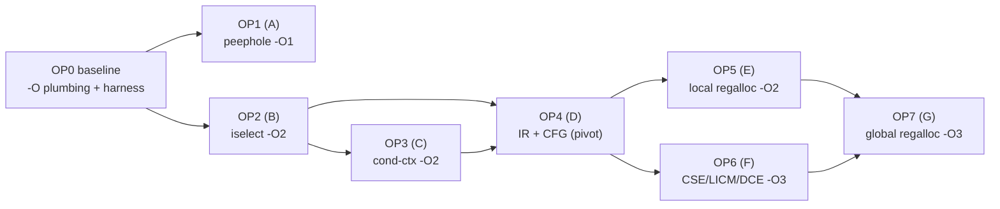

# c68k — Optimizing Compiler: Implementation Plan & Progress

> **Status:** Draft 0.1 (2026-07) · The phased program that turns the back end from a correct
> stack machine into a **full optimizing compiler**, realizing the Tier A–G roadmap and the 14-item
> Opportunity catalog of [codegen.md](codegen.md#11-optimization-roadmap).
> **This document tracks optimizer progress.** Update the [dashboard](#progress-dashboard) and the
> per-phase checkboxes as work lands. It is the optimizer companion to the whole-project
> [implementation-plan.md](implementation-plan.md) (P12/P13); the design rationale, generated-code
> analysis, and tier definitions live in [codegen.md](codegen.md).

The plan is **8 phases, OP0–OP7**. OP0 is the measurement + `-O`-level foundation; OP1–OP3 are the
single-pass wins that need no IR; **OP4 (the IR/CFG pivot)** unlocks OP5–OP7. Every phase ends at a
**measured, lockstep-green** milestone and is gated by the [design invariants](#design-invariants).

Legend: ☐ not started · ◐ in progress · ☑ done.

## Table of contents

1. [Existing baseline (`-O1` today)](#existing-baseline--o1-today)
2. [Progress dashboard](#progress-dashboard)
3. [Milestones](#milestones)
4. [`-O` level model](#-o-level-model)
5. [Design invariants](#design-invariants)
6. [Measurement & verification](#measurement--verification)
7. [Phases OP0–OP7](#op0--baseline-harness--o-level-plumbing)
8. [Catalog → phase map](#catalog--phase-map)
9. [Dependency graph](#dependency-graph)
10. [How to update this document](#how-to-update-this-document)
11. [Changelog](#changelog)

---

## Existing baseline (`-O1` today)

What already exists (P12/P13 — *not* part of this plan's phases; the starting point OP1+ build on):

- **Immediate-operand folding** and **power-of-two strength reduction** for a **constant right
  operand** ([`gen_const_binop`](../src/codegen68k.c#L714)).
- A **peephole** pass (R1 address↔data round-trip, R2 dead `move.l a0,d0`, R3 `lea`+load → EA fold).
- **`moveq`/`addq`/`subq`** tightest immediate encodings; whole-function dead-code elimination;
  self-declaring imports.
- **Gated behind `-O1`**; `-O0` is byte-identical to the naive stack machine (the self-host anchor).

Measured: `CORETEST.PRG` 95,824 (`-O0`) → 78,736 (`-O1`) → **75,440 with the addressing-mode fold
(−21 %)**; full lockstep green on both OSes at `-O1`. This plan extends `-O1` (OP1) and introduces
**`-O2`** (OP2–OP3, OP5) and **`-O3`** (OP6–OP7).

---

## Progress dashboard

| Phase | Tier | Title | `-O` | Status | Tasks | Milestone |
| --- | :---: | --- | :---: | :---: | :---: | --- |
| **OP0** | — | [Baseline, harness & `-O`-level plumbing](#op0--baseline-harness--o-level-plumbing) | — | ☑ | 4 / 4 | benchmark corpus + `-O2`/`-O3` levels + gates |
| **OP1** | A | [Peephole & local rewrites](#op1--tier-a-peephole--local-rewrites) | O1 | ☑ | 4 / 4 | obvious embarrassments gone |
| **OP2** | B | [Local instruction selection](#op2--tier-b-local-instruction-selection) | O2 | ☑ | 5 / 5 | most push/pop pairs gone |
| **OP3** | C | [Condition-context codegen](#op3--tier-c-condition-context-codegen) | O2 | ☑ | 3 / 3 | comparisons branch on flags |
| **OP4** | D | [IR + CFG (the pivot)](#op4--tier-d-ir--cfg-the-pivot) | O2/O3 | ☐ | 0 / 5 | AST → IR → select → emit |
| **OP5** | E | [Local register allocation](#op5--tier-e-local-register-allocation) | O2 | ☐ | 0 / 4 | temporaries live in `D2–D7`/`A2–A5` |
| **OP6** | F | [Global optimizations](#op6--tier-f-global-optimizations) | O3 | ☐ | 0 / 4 | CSE / LICM / DCE / IV reduction |
| **OP7** | G | [Global register allocation](#op7--tier-g-global-register-allocation) | O3 | ☐ | 0 / 3 | whole-function allocator |
| | | **Total** | | **4 / 8** | **16 / 32** | |

---

## Milestones

1. **MO1 — `-O1` polished** (end OP1) ✅: the peephole/local-rewrite embarrassments from
   [codegen.md §10.6/§10.8](codegen.md#106-redundant-epilogue-branch-and-dead-zero-init) are gone;
   measurable size cut on the corpus, `-O0` still byte-identical.
2. **MO2 — `-O2` local** (end OP3) — *codegen complete; `-O2` self-host blocked*: memory-source
   operands, either-side constants, richer strength reduction, and condition-context branching — the
   **biggest win achievable without an IR**. The full lockstep passes at `-O2` on both OSes; the
   byte-identical **`-O2` self-host is blocked by a separate, pre-existing libheap SOA
   `.data`-corruption bug** (`stage3 -Tu unicode` fails@3504), tracked independently of the optimizer.
3. **MO3 — IR pivot** (end OP4): codegen is **AST → IR → (optimize) → select → emit** with a CFG and
   tiling instruction selection, `-O0`/`-O1` paths untouched, `-O2` re-expressed over the IR at parity.
4. **MO4 — `-O2` registers** (end OP5): local register allocation eliminates the
   [§10.1](codegen.md#101-everything-round-trips-through-memory-no-register-allocation) memory
   round-trips for straight-line code; callee-saved `MOVEM` prologue/epilogue.
5. **MO5 — `-O3` optimizing** (end OP7): CSE/LICM/DCE + a whole-function register allocator — a
   genuinely optimizing compiler; measurable speed + size gains, every test green on both OSes.

---

## `-O` level model

| Level | Meaning | Phases |
| --- | --- | --- |
| **`-O0`** | Naive stack machine (default). **Byte-identical invariant** — never changes. | (baseline) |
| **`-O1`** | Immediate select, pow2 strength reduction, peephole R1–R3 + the Tier A rewrites. | existing + OP1 |
| **`-O2`** | `-O1` + Tier B local instruction selection + Tier C condition-context + Tier E local regalloc. | OP2, OP3, OP5 |
| **`-O3`** | `-O2` + Tier F global optimizations + Tier G global register allocation. | OP6, OP7 |

`-Os`/`-Oz` continue to alias the size-favoring subset (today == `-O1`); as OP2+ land they select the
size-reducing transforms (memory operands, strength reduction, DCE) while deferring speed-only,
size-neutral choices. `-Ofast` == `-O3` (no fast-math relaxations — soft-float stays IEEE-correct).
Each new level is **opt-in**; the invariant is that a lower level's output is never perturbed by a
higher level's work.

---

## Design invariants

These gate **every** phase (from [codegen.md §13](codegen.md#13-design-invariants-for-any-optimizer-work)):

1. **`-O0` stays byte-identical.** No pass may alter `-O0` output — it is the self-host
   stage2==stage3 anchor and the golden/lockstep baseline. Gate everything on `opt_level`.
2. **Dual-encoder parity.** Every new mnemonic or addressing mode must assemble identically under
   **`asm68K`** *and* the **integrated ELF emitter** (`C68K_INTEGRATED_AS=1`).
3. **Validate on both OSes.** Each change is proven by the **lockstep** suite (Osiris + CP/M-68K) and,
   for the compiler's own TUs, by **self-host byte-identity** at the levels it touches.
4. **Correctness knobs stay conservative.** Signed-division rounding, NaN-unordered float compares,
   big-endian narrow-scalar slot placement, and VLA/`setjmp` SP discipline are contracts — any
   optimization touching them carries a targeted test.
5. **Prefer shippable increments.** OP1–OP3 each stand alone; land them independently rather than
   waiting on the IR (OP4).

---

## Measurement & verification

**Benchmark corpus** (`tests/opt/` + existing programs), measured per phase:

- The [codegen.md §10](codegen.md#10-analysis-of-the-generated-code) sample
  (`add3/sum_loop/idx/cond/reuse/muldiv/cmp_chain/store_const`) — the canonical before/after.
- `samples/*` (hello, printftest, hexdump, filerw) + the lockstep programs (coretest, c99test,
  mathtest, libtest, …) — real-world integer/library code.
- A small **micro-suite** — one file per opportunity (memory operands, indexed addressing, cond
  branching, strength reduction, register reuse, CSE, LICM) — asserting the *expected instruction
  form* appears (a `grep` over the emitted asm) so a regression in a transform is caught precisely.

**Metrics:** stripped `.text` size (primary), emitted instruction count, and — where a
representative loop exists — a 68000 cycle estimate. The dashboard records the size delta vs `-O0`.

**Gates, run at each phase's `-O` level:**

- **G1 Correctness** — full **lockstep** green on both OSes at the phase's level (`C68K_OPT=<n>`).
- **G2 Invariant** — `-O0` output unchanged (byte-diff) and **self-host stage2==stage3** byte-identical
  at `-O0` (and, from MO2, at `-O2`).
- **G3 Parity** — both encoders emit identical objects for the new forms.
- **G4 Micro** — the phase's `tests/opt/` cases show the intended transform and correct results.
- **G5 No-regression** — no benchmark grows; the intended targets shrink.

CI wires G1–G4 per commit; G5 is tracked in the dashboard/changelog.

---

## OP0 — Baseline, harness & `-O`-level plumbing

**Objective:** the infrastructure every later phase needs — `-O2`/`-O3` levels, the benchmark corpus,
and the regression gates — with **zero codegen change**.

- [x] **`-O` levels.** `-O2`→2, `-O3`→3, `-Ofast`→3, `-Os`/`-Oz`→1 in
      [`main.c`](../src/main.c); numeric `opt_level` (0/1/2/3) threaded. **Verified output-neutral:**
      `-O0` unchanged, `-O1`==`-O2`==`-O3` (every gate is `opt_level >= 1`; no level-2/3 transform yet).
- [x] **Benchmark corpus + measure script.** [`tests/opt/bench.c`](../tests/opt/bench.c) +
      [`tools/opt-measure.ps1`](../tools/opt-measure.ps1) (instruction count + `.text` size at
      `-O0..-O3`, deltas vs `-O0`, optional CSV). **Baseline:** `bench.c` `-O0` **582 insns / 1042
      `.text`** → `-O1` **441 / 740** (−24 % / −29 %); `-O2`/`-O3` identical to `-O1`.
- [x] **Micro-test harness.** [`tools/opt-check.ps1`](../tools/opt-check.ps1) — grep-the-asm rules,
      the current `-O1` transforms as self-test **PASS** (4) and the OP1–OP3 targets as **PENDING**
      (7; each flips to PASS when its phase lands).
- [x] **Self-host-at-level check.** [`build-cc.ps1`](../tools/osiris/build-cc.ps1) honors
      `C68K_OPT=<n>` → builds CC.PRG at `-O<n>`. `-O2` self-host == the proven `-O1` stage2==stage3
      (output-identical today); a distinct `-O2` self-host run becomes meaningful once OP2 diverges `-O2`.

**Exit:** ✅ `-O0..-O3` build **identically** (output-neutral, host-verified — the lockstep/self-host
baselines are unchanged by construction); the corpus + measure + micro-check harnesses are in and the
baseline is recorded.
**Depends on:** the existing `-O1` tier (P12/P13).

---

## OP1 — Tier A: Peephole & local rewrites  ☑

**Objective:** cheap, low-risk local rewrites on the existing buffered stream that remove the obvious
embarrassments — **extends `-O1`**. *(Catalog #1–#3.)*

- [x] **#1 Branch-to-next / dead-after-transfer.** Peephole **R4** drops `bra L`/`bra.s L` when `L:` is
      the next line (kills every redundant `bra L_return_<fn>` before the epilogue and the trailing
      `bra L_end_N` of a linearised `if`/`&&`/`||`); **R5** deletes the unreachable instructions
      between a `bra`/`jmp`/`rts` and the next label. Both are exact local equivalences gated at
      `opt_level>=1` (`codegen68k.c` `peephole()`). *(Adjacent empty-label coalescing is cosmetic —
      labels emit 0 bytes — and is left as-is.)*
- [x] **#2 Small `MEMZERO` → unrolled `clr`.** `ND_MEMZERO` of a small object (≤ 16 B, even offset —
      every local is ≥ 2-aligned) lowers to straight-line `clr.l`/`clr.w`/`clr.b` instead of the
      `lea`+`move.w`+`clr.b`+`dbra` byte loop; a scalar `int t = …;` collapses to a single
      `clr.l d(a6)`. Gated at `opt_level>=1`; the `dbra` loop is retained at `-O0` and for large
      objects ([§10.6](codegen.md#106-redundant-epilogue-branch-and-dead-zero-init)). *(The dead-store
      half — dropping the zero-init entirely when the initializer fully covers the scalar — is left to
      DCE in OP6.)*
- [x] **#3 `__func__` duplication.** At `-O1+`, `__func__` and `__FUNCTION__` share **one** name-string
      literal instead of two identical copies per function (`parse.c` `funcdef`, gated on `opt_level`);
      halves the synthesized name-string `.data`
      ([§10.8](codegen.md#108-front-end-data-bloat)). *(Full suppression of the still-unreferenced
      literal needs data liveness — deferred.)*
- [x] Measure + gate (G1–G5); dashboard size delta updated.

**Result (bench corpus).** `-O1` **336 insns / 658 B `.text`** (was 441 / 740 at OP0): **−105 insns,
−82 B** on top of OP0, **42.3 % fewer insns than `-O0`** (582 / 1042). Synthesized name-string literals
per TU halved (4 → 2 on the two-function probe). `-O0` unchanged at **582 / 1042** — every rule is gated
at `opt_level>=1`. Micro-check `no-bra-to-next` **PASS**; full lockstep **26/26 on both OSes at `-O1`**.

**Exit (MO1):** the §10.6/§10.8 embarrassments are addressed; measurable corpus size cut; `-O0`
byte-identical. ✅
**Risk:** low — each rule a provable local equivalence; no data-flow needed.
**Depends on:** OP0.

---

## OP2 — Tier B: Local instruction selection  ☑

**Objective:** exploit the two-operand CISC — the **biggest win without an IR** — by selecting memory
operands, direct stores, either-side constants, indexed addressing, and richer strength reduction.
**Lands `-O2`** (the first level that diverges from `-O1`). *(Catalog #4–#8.)*

- [x] **#4 Memory-source operands.** A binary op whose RHS is a simple size-4 lvalue (`disp(a6)` frame
      slot or `_g` global) folds into `add.l ea,d0` / `sub.l ea,d0` / `cmp.l ea,d0` / `and.l/or.l ea,d0`
      instead of push/pop + `D1`. EOR has no `<ea>,Dn` form and stays generic
      ([§10.3](codegen.md#103-the-68000-is-a-two-operand-cisc-but-memory-operands-go-unused)). `gen_mem_binop`.
- [x] **#5 Direct store to lvalue EA.** `lval = v` for a simple scalar lvalue → `move.<sz> d0,disp(a6)`
      / `move.<sz> d0,_g` with no address push/pop (bitfields/aggregates/8-byte stay generic)
      ([§10.5](codegen.md#105-address-arithmetic-ignores-indexed-addressing-and-constant-folding)).
- [x] **#6 Constant on either side.** A constant LHS is canonicalized: commutative ops (`+ * & | ^ == !=`)
      fold via the existing fast path; `c < x` / `c <= x` emit `x > c` / `x >= c` with the reversed
      condition (`sgt`/`sge`/`shi`/`shs`) so `x > 10` hits `cmp.l #10,d0`
      ([§10.4](codegen.md#104-constant-on-the-left-misses-the-fast-path)). `gen_const_binop_left`.
- [x] **#7 Indexed addressing.** `arr[i]`/`p[i]` with a simple var base and a longword element loads
      through the 68000 `(An,Xn.L)` brief-extension-word mode (`gen_indexed_load`) instead of push/pop
      + add. Required the **encoder's first mode-6** (`parse_ea` in `emit_elf.c`) plus a **paren-aware
      operand split** (the old `strchr(',')` broke `(a0,d1.l),d0` at the inner comma → a bogus
      undefined symbol that only surfaced at *link* time). Byte-validated vs GNU objdump *and* asm68K
      (`2030 1800`), then link-validated by the lockstep. Indexed stores stay generic (value/index
      register pressure) ([§10.5](codegen.md#105-address-arithmetic-ignores-indexed-addressing-and-constant-folding)).
- [x] **#8 Strength-reduction extensions.** Signed `x/2ⁿ` (bias-then-`asr`) and `x%2ⁿ` (sign-corrected
      mask) inline instead of `__divsi3`/`__modsi3`; small `x*(2ᵃ±1)` (×3/×5/×7/×9/…) as a shift+add/sub
      net instead of `__mulsi3` ([§10.7](codegen.md#107-missed-local-strength-reductions)).
- [x] Measure + gate (G1–G5).

**Result (bench corpus).** `-O2` **281 insns / 558 B `.text`** — down from the `-O1` baseline **336 / 658**
(**−55 insns / −100 B**; **51.7 % fewer insns than `-O0`**). `-O1` **unchanged at 336 / 658** and `-O0`
at 582 / 1042 (every rule gated `opt_level>=2`). All five µ-checks (`mem-operand`, `direct-store`,
`const-left-cmp`, `indexed-addr`, `sdiv4-no-call`) **PASS**. **G3:** both encoders emit byte-identical
code for every new form (mode-6 confirmed `2030 1800`). Full lockstep **26/26 on both OSes at `-O2`**.

**Exit:** most push/pop pairs for simple expressions gone; the µ-suite shows each new form; `-O0`/`-O1`
unchanged; lockstep green at `-O2`. ✅
**Risk:** medium — **G3 dual-encoder parity** was the gate; the integrated emitter gained mode-6 and was
byte-validated before the on-target run.
**Depends on:** OP0 (independent of OP1; both extend the single-pass generator).

---

## OP3 — Tier C: Condition-context codegen  ☑

**Objective:** stop materializing 0/1 booleans that only feed a branch. **Lands `-O2`.** *(Catalog #9.)*

- [x] **#9 `gen_cond(node, label, jump_when)`.** A dedicated path that lowers relational/`!`/`&&`/`||`
      **directly to `cmp` + `Bcc`** when the value feeds `if`/`for`/`while`/`do`/`?:` (short-circuit,
      recursive), never emitting `Scc`+`andi`+`tst`
      ([§10.2](codegen.md#102-booleans-are-materialized-then-re-tested-in-condition-context)). It reuses
      OP2's const-RHS / const-LHS / memory-operand compare selection, so `if (a<b)` becomes
      `cmp.l 12(a6),d0` / `bge`. The boolean-producing path stays for when the value is used as data.
- [x] **Correct `Bcc` selection.** `Rel` + `rel_negate`/`rel_swap`/`bcc_mnem` pick signed vs unsigned
      (`blt/bge` vs `bcs/bcc`, `ble/bgt` vs `bls/bhi`), matching the boolean path's signedness exactly.
      Float and 64-bit relationals fall back to materialize-then-test-zero, so **NaN-unordered float
      compares keep their `BVS` guard** (invariant #4).
- [x] Measure + gate (G1–G5).

**Result (bench corpus).** `-O2` **281/558 → 264/498** (**−17 insns / −60 B**; **54.6 % fewer insns than
`-O0`**, `.text` 52.2 % smaller). `-O1` **unchanged at 336/658**, `-O0` at 582/1042 (every rule gated
`opt_level>=2`). Micro-check `cond-no-scc` **PASS**. Full lockstep **26/26 on both OSes at `-O2`**.
OP3 codegen is verified correct — the `-O2`-built compiler's intermediate asm is byte-identical to the
host `-S` reference — but the byte-identical **`-O2` self-host is blocked by a separate, pre-existing
libheap SOA `.data`-corruption bug** (the allocator scribbles a class-24 free-list over the assembler's
`.data` buffer when compiling `unicode.c`/`preprocess.c`; `stage3 -Tu unicode` fails@3504), tracked
independently of the optimizer. *(Tooling: build-cc.ps1's `C68K_OPT` splat — a bare literal before a
non-empty array splat — was mangled by pwsh 7.6; fixed to a single full-array splat.)*

**Exit (MO2):** comparisons in control context branch on flags (−3–4 instr each) and full lockstep
passes at `-O2` on both OSes ✅; the byte-identical **`-O2` self-host remains blocked** by the separate
libheap SOA `.data`-corruption bug (`stage3 -Tu unicode` fails@3504), not by OP3 codegen.
**Risk:** medium — condition inversion/`Bcc` selection is error-prone; the µ-suite pins each form and
lockstep + `-O2` self-host cover the float-unordered and compiler-own-code paths.
**Depends on:** OP0.

---

## OP4 — Tier D: IR + CFG (the pivot)

**Objective:** introduce a linear **IR** (three-address quads / simple SSA) and **basic blocks + a
CFG** between the AST walk and emission — the prerequisite for real register allocation and every
global optimization. **Infrastructure behind `-O2`/`-O3`.** *(Catalog #10.)*

- [ ] **IR datatypes + builder.** An `AST → IR` lowering producing three-address ops over virtual
      registers, with the existing lowerings (soft-float/`long long`/struct/VLA/`setjmp`) preserved.
- [ ] **Basic blocks + CFG.** Split at labels/branches; build predecessor/successor edges; a
      block/edge iterator the later passes consume.
- [ ] **Tiling instruction selection.** Replace fixed 1:1 templates with a maximal-munch matcher over
      the IR (subsumes OP2's addressing-mode/memory-operand choices as tiles).
- [ ] **IR → asm emitter** feeding both encoders; **re-express `-O2` (OP2/OP3) over the IR at parity**
      (same or better output than the single-pass `-O2`).
- [ ] Measure + gate (G1–G5); **`-O0`/`-O1` remain the single-pass path, untouched**.

**Exit (MO3):** codegen is `AST → IR → select → emit` at `-O2`+; `-O0`/`-O1` byte-identical; `-O2`
output ≥ the single-pass `-O2`; self-host stage2==stage3 holds at `-O0` and `-O2`.
**Risk:** **high** — largest architectural change. Mitigation: keep the single-pass `-O0`/`-O1` path
in place; land the IR strictly behind `-O2`/`-O3`; gate on parity + self-host before removing any
single-pass `-O2` code.
**Depends on:** OP2, OP3 (their transforms become IR tiles/passes).

---

## OP5 — Tier E: Local register allocation

**Objective:** keep expression temporaries and hot locals in `D2–D7`/`A2–A5` within a basic block —
kill the memory round-trips. **Lands `-O2`.** *(Catalog #11 — impact XL.)*

- [ ] **Per-block liveness** over the IR; **linear-scan/interval allocation** across `D2–D7`/`A2–A5`
      (data vs address classes), spilling to frame slots only on pressure.
- [ ] **Callee-saved `MOVEM`.** Prologue `movem.l <used>,-(sp)` / epilogue `movem.l (sp)+,<used>` for
      exactly the callee-saved registers the allocation used (matches the ABI in
      [architecture.md §7.2](architecture.md#72-calling-convention--abi)).
- [ ] **Caller-saved discipline** across calls (`D0/D1/A0/A1` clobbered) — spill/reload live values
      around `jsr` (the [asm-callee-clobbers](codegen.md) hazard class).
- [ ] Measure + gate (G1–G5).

**Exit (MO4):** the §10.1 `reuse`/`sum_loop` round-trips become register ops; straight-line code holds
values in registers; lockstep green at `-O2`; self-host at `-O2`.
**Risk:** medium — spill correctness + the caller/callee-saved boundary; the µ-suite + lockstep + the
setjmp/VLA cases (invariant #4) gate it.
**Depends on:** OP4.

---

## OP6 — Tier F: Global optimizations

**Objective:** CFG/data-flow optimizations over the IR. **Lands `-O3`.** *(Catalog #12–#13.)*

- [ ] **#12 CSE + copy/constant propagation + DCE/DSE.** Common-subexpression elimination (`p[i]`,
      reloaded `n`/`&arr` from [§10.3/§10.5](codegen.md#10-analysis-of-the-generated-code)),
      copy/constant propagation, and dead-code/dead-store elimination (generalizes OP1 #2).
- [ ] **#13 LICM + induction-variable strength reduction.** Hoist loop invariants (`n`, `&arr` out of
      `sum_loop`); turn array-walk `arr[i]` into pointer bumping (`(An)+`).
- [ ] **Equivalence testing.** Diff `-O3` behavior against `-O0`/`-O1` on the corpus + lockstep
      (same results); the µ-suite asserts the hoist/CSE/pointer-bump forms.
- [ ] Measure + gate (G1–G5).

**Exit:** measurable further size/speed gains on loop/array code; every test green on both OSes at
`-O3`; `-O0`/`-O1`/`-O2` unchanged.
**Risk:** high — data-flow correctness (aliasing, `volatile`, call clobbers). Mitigation: conservative
aliasing; `volatile` never optimized; gate at `-O3` with full equivalence testing.
**Depends on:** OP4 (and benefits from OP5).

---

## OP7 — Tier G: Global register allocation

**Objective:** a whole-function allocator over the IR, subsuming OP5's local pass. **Lands `-O3`.**
*(Catalog #14 — impact XL.)*

- [ ] **Whole-function allocation** — graph-coloring or global linear-scan over live ranges spanning
      blocks, with real **spill heuristics** (spill cost, live-range splitting).
- [ ] **Integration** with OP6 (allocate after global opts) and the ABI `MOVEM`/caller-saved rules.
- [ ] Measure + gate (G1–G5); confirm it dominates the OP5 local allocator on the corpus.

**Exit (MO5):** whole-function register allocation; a genuinely optimizing `-O3`; measurable gains,
all tests green on both OSes; self-host at `-O2`/`-O3`.
**Risk:** high — allocator complexity + spill correctness. Mitigation: keep OP5's local allocator as
the fallback/`-O2` path; extensive lockstep + self-host gating.
**Depends on:** OP5, OP6.

---

## Catalog → phase map

| Catalog # ([codegen.md §12](codegen.md#12-opportunity-catalog)) | Tier | Phase | Impact |
| --- | :---: | :---: | :---: |
| 1 Branch-to-next / dead-after-transfer / label coalesce | A | OP1 | S |
| 2 Dead scalar zero-init; small `MEMZERO`→`clr.l` | A | OP1 | S |
| 3 Unreferenced/duplicated `__func__` data | A | OP1 | S |
| 4 Memory-source operands | B | OP2 | L |
| 5 Direct store to lvalue EA | B | OP2 | L |
| 6 Constant on either operand side | B | OP2 | M |
| 7 Indexed `(An,Xn)` + constant-index/address folding | B | OP2 | L |
| 8 Signed pow2 div/mod; small non-pow2 multiply | B | OP2 | M |
| 9 Condition-context branch fusion | C | OP3 | L |
| 10 IR + basic blocks + CFG | D | OP4 | — |
| 11 Local register allocation | E | OP5 | XL |
| 12 CSE / copy-prop / DCE | F | OP6 | L |
| 13 LICM + induction-variable strength reduction | F | OP6 | L |
| 14 Global register allocation | G | OP7 | XL |

---

## Dependency graph

OP1/OP2/OP3 are independently shippable single-pass wins; **OP4 is the investment** that unlocks the
register allocator (OP5/OP7) and the global optimizations (OP6).

---

## How to update this document

1. Flip the task checkbox (`[ ]`→`[x]`) as each task lands.
2. Update the phase **Status** (☐/◐/☑) and **Tasks n / N** in the [dashboard](#progress-dashboard),
   and the **Total** row (`x / 8` phases, `n / 32` tasks).
3. Record the corpus **size/speed delta** and the level it applies to (per [measurement](#measurement--verification)).
4. When a milestone closes, note it here and in the [changelog](#changelog); cross-check the
   [implementation-plan.md](implementation-plan.md) P12/P13 progress notes.

---

## Changelog

| Date | Version | Change |
| --- | --- | --- |
| 2026-07 | Draft 0.1 | Initial optimizer plan (OP0–OP7) realizing the [codegen.md](codegen.md) Tier A–G roadmap + 14-item Opportunity catalog: `-O` level model, design invariants, measurement/verification gates, per-phase objectives/tasks/exit criteria, catalog→phase map, dependency graph. All phases ☐ (the current `-O1` tier is the baseline OP1+ build on). |
| 2026-07 | Draft 0.1 | **OP0 done (4/4).** `-O2`/`-O3` level plumbing ([main.c](../src/main.c); output-neutral — `-O1`==`-O2`==`-O3`); [`tests/opt/bench.c`](../tests/opt/bench.c) + [`tools/opt-measure.ps1`](../tools/opt-measure.ps1) (baseline `bench.c` `-O0` 582 insns/1042 `.text` → `-O1` 441/740) + [`tools/opt-check.ps1`](../tools/opt-check.ps1) (4 self-test PASS, 7 PENDING); [`build-cc.ps1`](../tools/osiris/build-cc.ps1) honors `C68K_OPT=<n>` for self-host-at-level. |
| 2026-07 | Draft 0.1 | **OP1 done (4/4).** Tier A local rewrites, all gated `opt_level>=1`: peephole **R4** (branch-to-next) + **R5** (dead-after-transfer) in [codegen68k.c](../src/codegen68k.c); small `ND_MEMZERO` → unrolled `clr.l`/`clr.w`/`clr.b`; `__func__`/`__FUNCTION__` share one literal ([parse.c](../src/parse.c) `funcdef`). `bench.c` `-O1` **441/740 → 336/658** (−105 insns / −82 B; 42.3 % below `-O0`); `-O0` unchanged (582/1042). `no-bra-to-next` flipped PENDING→PASS; full lockstep 26/26 both OSes at `-O1`. |
| 2026-07 | Draft 0.1 | **OP2 done (5/5).** Tier B instruction selection, all gated `opt_level>=2` (first level to diverge from `-O1`): memory-source operands (#4), direct store to lvalue EA (#5), constant-LHS canonicalize/reverse (#6), indexed `(An,Xn.L)` load (#7 — **encoder's first mode-6** in [emit_elf.c](../src/emit_elf.c) + a **paren-aware operand split**; byte-validated vs objdump + asm68K, then link-validated), signed `x/2ⁿ`·`x%2ⁿ` + `x*(2ᵃ±1)` nets (#8). `bench.c` `-O2` **336/658 → 281/558** (−55 insns / −100 B; 51.7 % below `-O0`); `-O1` unchanged (336/658). All 5 OP2 µ-checks PENDING→PASS; full lockstep 26/26 both OSes at `-O2`. |
| 2026-07 | Draft 0.1 | **OP3 done (3/3).** Tier C condition-context codegen, gated `opt_level>=2`: `gen_cond` lowers relational/`!`/`&&`/`||` in `if`/`for`/`while`/`do`/`?:` straight to `cmp`+`Bcc` (short-circuit, correct signed/unsigned `Bcc`; float/64-bit fall back to materialize-then-test so the NaN `BVS` guard is preserved). `bench.c` `-O2` **281/558 → 264/498** (−17 insns / −60 B; 54.6 % below `-O0`); `-O1` unchanged (336/658). `cond-no-scc` PENDING→PASS; full lockstep 26/26 both OSes at `-O2`. **MO2's byte-identical `-O2` self-host is blocked by a separate known libheap SOA `.data`-corruption bug** (`stage3 -Tu unicode` fails@3504; OP3 codegen verified correct via byte-identical intermediate asm). Also fixed build-cc.ps1's `C68K_OPT` splat (pwsh 7.6 mid-command array-splat bug). |
